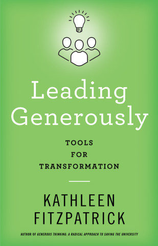

## The Path Forward
---
### The Futures of Research and Graduate Studies
---
 
<smaller>Kathleen Fitzpatrick // @kfitz@hcommons.social // kfitz@msu.edu</smaller> 
<small>http://presentations.kfitz.info/assocdean250410.html</small>

Note: Thanks so much for that introduction, Charlene, and thanks to all of you for joining me here today. I'm grateful to the search committee for their work, and for giving me this opportunity to talk with you a bit about some of my thinking about the futures of research and graduate studies in the college. 

*You should give a 45-minute talk (with 15 minutes for questions) addressing graduate education and grant and research support for faculty and students. The talk should be forward-looking, as much as it can be in these times of uncertainty. We ask that you give specific examples of what you would like to accomplish. In addition, we would like you to talk about how you would overcome the challenges of leading a unit whose research includes the humanities, social sciences, visual arts, performing arts, and interdisciplinary research.*

Note: The search committee provided me with this prompt for this talk -- and I want to apologize a tiny bit for starting today with the classic lit-crit move of asking some questions about the prompt, but it's crucial to me to make sure that we're starting the process of thinking together about our collective future with as much of a shared understanding as is possible.

**(CLICK)** So let's start here: I firmly believe that the diversity of methodologies, theoretical approaches, and disciplinary backgrounds represented in the College of Arts & Letters is not a challenge to be overcome, but rather a source of our strength. I say this as a scholar with an MFA in creative writing and a PhD in English and American literature, and as an author whose writing has confounded a lot of disciplinary expectations. I say this as a faculty member who started her career jointly appointed in English and Media Studies, and as a digital humanist whose primary work has involved network building. I've straddled a lot of lines over the years, and am convinced that the more we can do individually and collectively to build connections across the disciplinary boundaries that try to divide us, the stronger we'll be, both individually and as a college.

## our diversity is our strength

Note: We study our world's cultures and their modes of thought and expression, and we create new contributions to those cultures. We engage with different nations, different languages, different traditions, different communities. We ask different questions and use different methods in seeking answers. And we produce different kinds of work in those engagements. If we approach those differences from a competitive, scarcity-oriented mindset, then yes, our differences become challenges that we need to somehow get past in order to work together. But if instead we approach those differences from a collaborative perspective, with a belief in our collective abundance, then those differences will allow us to do more kinds of work together. We can learn from one another, we can share with one another, and we can increase our shared understanding in the process.

<section>
    
    
</section>

Note: This belief is in part the basis for the arguments that I've made in my last two books, *Generous Thinking* and *Leading Generously* -- that, in order to create the best possible conditions for success for the work that we are all committed to doing, we have to do it together, and that "together" requires us all to reground ourselves in collaboration rather than competition, in listening to and learning from one another rather than thinking of our differences as barriers to understanding. I don't at all want to suggest that this is easy -- collaboration is hard, listening and learning are hard, and building and supporting diverse teams are hard -- but that's the work I've committed myself to over the last fifteen years, and that's the work that I hope I will be able to keep doing in the college.

The difficulty of all of this points to another part of the prompt that I want to revisit:

*You should give a 45-minute talk (with 15 minutes for questions) addressing graduate education and grant and research support for faculty and students. The talk should be forward-looking, as much as it can be in these times of uncertainty. We ask that you give specific examples of what you would like to accomplish. In addition, we would like you to talk about how you would overcome the challenges of leading a unit whose research includes the humanities, social sciences, visual arts, performing arts, and interdisciplinary research.*

Note: "These times of uncertainty" turns out to be a massive (and growing) understatement of the situation. Not that it hasn't always been true that we don't know what the future holds -- but trying to look forward right now results in little but uncertainty. We don't know what research and graduate studies in the college will look like five years from now, not least because we don't know what's going to happen *tomorrow* that has the potential to radically reshape everything about the ways we work as scholars, as artists, as teachers, as mentors, and as colleagues.

# what do we know?

Note: So what do we know? We know that the process of obtaining support for research and creative activity through grant funding has always been hard -- and we know that it has just gotten a LOT harder. But we also know that there are still opportunities out there, and not just opportunities but enormous *need* for the expertise, the talent, the collaborative potential and the community building that CAL engages in. We know that resources are scarce, but we also know that creativity and commitment are not. With all of that in mind, I want to offer both some thoughts about where we are today, and how we'll cope with the months ahead, as well as where I hope that we might be able to go in the future.

## Hope is a discipline.
### *--Mariame Kaba*

Note: I want to ground my thinking in the recognition that it takes a lot of work to maintain hope at a moment like this, but that hope is becoming more and more necessary. As abolitionist organizer Mariame Kaba has noted, hope is not an emotion -- it's not optimism. Hope is instead a practice, and one that has to be practiced every day, if we are to find ways of coming together and fixing the many things wrong with the world around us. There are days -- and we've experienced a lot of them lately -- when that hope is hard to sustain. But I want to do what I can to ensure that another world, another university, another college might be possible. 

# funding

Note: So. Let's start with the elephant in the room: external funding. There has always been far less available than we need, and last week that situation got a lot worse. Many of our fields have long relied on federal funding for key forms of support, and a number of our faculty members have lost that funding in recent weeks, leaving their projects up in the air. Worse, many of our colleagues in the college have been hired on those grants, and are now quite vulnerable. Our first priority must be working to ensure that we can protect as many of these colleagues as possible, whether that means finding other support to continue their projects or seeking other roles for them in the college. Please know that the dean's team is actively working on those questions and trying to do as much as they can to ameliorate the situation.

Continuing the important research and creative activity being done across the college will require us to find other sources of support, and we'll particularly need to think about foundation-based funding. It's important to recognize, however, that private philanthropy operates very differently from federal funding agencies -- not least that their funding programs change much more rapidly, often in response to local, regional, and global crises, and sometimes in response to the priorities of their leadership.

# Foundation Relations

Note: Seeking foundation support thus requires keeping up with a highly fluid funding landscape. It also requires greater intentionality in relationship-building. We have a phenomenal resource in that relationship-building process in Foundation Relations; Melissa Anderson, who is CAL's key point of contact there, is really great at thinking with us about how to approach foundations, and she's super knowledgable about what particular foundations will and won't fund. You've probably seen a bunch of funding opportunities that Melissa has shared and that I've passed on; we're both serious about wanting to discuss these possibilities with you to help you shape an approach. It's important to know, however, that the process of applying for foundation support is often very different than the federal grant proposal process, and different foundations have processes that are equally different from one another. In many cases, foundation program officers want to be thought partners in helping to shape the work they fund, such that it serves their priorities as well as our own. Some foundations engage in a lot of back and forth with a program officer in drafting and revising a proposal before they accept it and present it to their boards. All of this requires persistence, and a willingness to think of the foundation as a collaborator in the process rather than just a funding agency.

# internal funding

Note: In addition to shifting our thinking a bit about where external funding comes from and how we go about applying for it, we also need to take a hard look at internal funding, both at the college level and at the university level. 

## Committee on Institutional Support for Research

Note: Over the last several months, I've been serving on a faculty-senate appointed ad-hoc committee charged with studying internal support for research and creative activity across the university and making some recommendations for creating greater equity across the campus. We know, for instance, that our colleagues in STEM fields often receive significant startup funds, necessary in order to get their labs equipped and operating, and while CAL offers incoming tenure-system faculty members startup funds, they are orders of magnitude smaller. We also know that other fields have long benefitted from the college and unit level allocations of indirects received from federal grants, and that those funds have enabled many units to be generous with other forms of internal funding. And we know that those fields are disproportionately represented in university-level honorifics including the University Distinguished Professorships, the MSU Research Foundation Professorships, and the Red Cedar Distinguished Professorships. We are hoping that the survey that the committee has just conducted and the interviews that are now being done will make those inequities transparent, and perhaps even begin to surface some pathways toward rectifying them.

# CAL Research

Note: The situation in CAL has long been and will continue to be tight; a significant number of grants in the college do not generate indirects, and those that do are often very small -- and the college only receives 20% of what is generated. In many other colleges, that 20% is divided between the college and the units where the principal investigator is housed -- but in those colleges, the units are almost always then responsible for post-award administration on those grants, and often for pre-award support as well. CAL made the decision some years back to keep those indirect funds in the college and use them to partially defray costs for the research team, thus allowing us to provide both pre- and post-award support at the college level. As those of you who have submitted proposal through the CAL Research team know, they are a group of exceedingly hardworking professionals who are excellent at what they do -- but there is increasingly too much for them to handle, especially at those inevitable moments of the semester when all the deadlines hit at once. One key priority, then, for ensuring the ability of folks in the college to secure external funding is adding capacity to the research team -- but doing so is going to require use to be extremely creative in thinking about the allocation of resources in the college.

# university funding

Note: So returning to internal funding, and thinking now beyond the college to university-level funding: the most important internal funding program for the arts & humanities at MSU is the Humanities and Arts Research Program, or HARP. HARPs have been extremely important over the last fifteen years and have enabled many faculty members to conduct research and to develop and build projects.

<section>
    
</section>

Note: Recently, the addition of the HARP large-scale program has helped facilitate projects that require more time and more resources to get off the ground, including *Choeurs Atlantiques*, the documentary film recently completed by Safoi Babana-Hampton, which was supported by the inaugural HARP large-scale grant.

# HARP

Note: But the HARP program is of course highly competitive at each of its levels, and the amount awarded for the HARP Development grants has not changed since the program's inception. Needless to say the funds don't go anywhere near as far as they used to and the need for support keeps increasing. I've begun a conversation with Charley Hasemann to find out how CAL can help him advocate for increased resources for HARPs

research futures:
	- in addition to shifting our thinking a bit about where external funding comes from and how we go about applying for it, we also need to take a hard look at internal funding
		- but 
		- we should as a college take a hard look at some of the other internal funding mechanisms through the Office of Research & Innovation, however, to see where we're not taking advantage of existing possibilities. For instance, the recently developed Shared Research Infrastructure Program was established to help avoid redundant expenditures in the sciences in particular, where every lab often needs the same piece of very expensive equipment; the SRIP provides funds designed to encourage clusters of labs or other units to invest together in shared infrastructure. How might we think about such research infrastructure needs from a collective perspective and seek support from the SRIP?
		- additionally, the SPG, or Strategic Partnership Grants, support team-based research whether at the early phase of project development or at the later phase of center development; these proposals require evidence of strong multidisciplinary collaborations as well as of a plan for seeking external funding to continue the work after the SPG seed funding is depleted
		- and the TETRAD program, launched in Fall 2023, is designed to support new cross-unit and cross-college collaborations as well
	- those last three programs (SRIP/SPG/TETRAD) point to the growing importance of collaborating not just within our fields but across them. In many -- not all, by any means, but many -- of our fields, that form of collaboration has not been baked into our training; we need to think about how we might learn from the science of team science and put some of those lessons to use in our own research processes. 
	- The research team has for several years run grant kick-off meetings once funding has been received in order to make sure that everyone involved -- faculty, staff, and administrators -- are on the same page about the processes for making hires and purchases and for reporting on the grant's progress. I would like to see us move some of that work even earlier in the flow: for instance, to establish *proposal* kick-offs, so that folks coming together to work with the research team on a grant proposal have some crucial conversations before submission. 
	- I would also like to see us develop some collaboration support processes and agreements, such that folks who are starting a new project together can be sure to have the right conversations with one another even before the proposal process, so that everyone is on the same page as far as they can possibly be about project decision-making, about rights and responsibilities, and more. Conversations like these can help us head off conflict before it begins
	- returning to the SPGs: the evidence of future external support potential that these proposals require, especially at the center level, might encourage us to think about developing more intentional pathways for the projects and labs and centers that have recently proliferated across CAL, including how we start them up, how they are charged with becoming sustainable, and how they are sunset at the appropriate moment
		- but I also want to think a bit about that proliferation, and have us ask ourselves some hard questions about our priorities
		- there's a running joke at a number of other institutions about every faculty member having their very own center; the issue isn't that the centers aren't doing important work, but rather that this proliferation calls for a lot of often redundant resources
		- rather than creating a new center for each new purpose, can we bring some of our centers together into larger units that serve more faculty and graduate students?
		- my biggest aspiration here might in fact be establishing a singular Center for the Arts & Humanities that could learn from the best such centers around the country, including the Denbo Center for Humanities and the Arts at the University of Tennessee, the Dresher Center for the Humanities at the University of Maryland-Baltimore Country, the Center for 21st Century Studies at the University of Wisconsin-Milwaukee, the Institute for Advanced Study at the University of Minnesota, the Humanities Research Institute at the University of Illinois-Urbana-Champaign, and more
		- a center such as this, like many of the centers I've named, would ideally be able to offer faculty and grad student fellowships to support research and creative activity and to create community among the fellows by having weekly lunch gatherings to share work, as well as opportunities for presentation and feedback
		- this center could bring together the work of some of our existing centers, and could coordinate resources to help avoid duplication of effort around things like project management, event planning and hosting, and more; one could imagine the Legacy Lecture, the Signature Lecture, etc, being brought together under this banner
		- the center could also offer infrastructure to support longer-term collaborative projects, and could be the incubator for other labs and centers
		- this would require significant fundraising to get off the ground, but it might be an exciting naming opportunity for the right donor, and I would be delighted to get the opportunity to work with our next dean and director of development on building the relationships that might lead to such a gift
		- in the meantime, we could begin laying the groundwork by thinking with the center and lab directors about how they might share resources and build collaborations with one another
- from here, I want to turn my attention to graduate studies:
	- the associate dean for research and graduate studies supports the graduate program directors and associate chairs for graduate studies as they lead their programs and support their students
		- the landscape for graduate studies has changed as radically and painfully as that of research funding in recent weeks; we have all heard stories about institutions such as the University of Massachusetts at Amherst that have rescinded all of their graduate admissions for next year, and other institutions that are radically downsizing their graduate programs
		- MSU in general, and CAL in particular, are NOT taking these radical steps right now. I cannot promise that they won't be imposed on us -- we have no idea what could still be ahead for us -- but I can promise that we will do everything in our power to ensure that our programs continue, and thrive
		- but it's important to note that the people that are being hit the hardest by the federal changes right now are of course some of the most vulnerable members of the college community -- our international graduate students, whose freedom of movement is threatened and whose ability to conduct their research in their chosen areas of the world is being undermined
		- the graduate office has been working with the Graduate School as well as the Office for International Students and Scholars to ensure that our international graduate students are as well-protected as they can be, that they have access to emergency support to allow them to stay in the US this summer in the event it's too risky for them to travel, and so on
		- we're also encouraging their graduate programs and advisors to work with them to develop alternative plans for their work in the event their research abroad is no longer possible, and to help any graduate student who must travel abroad prepare a plan B in the event they're not able to re-enter the country
	- in the face of all of that, it's challenging to think right now about what we'd actually *like* to do in order to make the graduate experience better, rather than just to keep it from getting worse, but there are some strategic ideas that I'm hoping to have the opportunity to work on in the years ahead
		- first, I want to place significant emphasis on expanding support for broadened career pathways for our doctoral students, as well as for broadened training opportunities during the degree process
		- one of the things that has inhibited many graduate programs around the country from thinking actively about the many career paths that should be open to their graduate students is a kind of parochialism, partly driven by the faculty's uninterrogated assumption that the best possible outcome for every PhD candidate is a job like ours -- despite the fact that we know that such jobs are harder and harder to get, and despite the equally true fact that however great our jobs may be, *there are other equally if not more rewarding career opportunities that we undervalue*
		- those career paths also remain undersupported because we don't know how to prepare our students for those kinds of careers; we haven't worked in the other roles on campus that hire advanced degree recipients in the arts and humanities, and we haven't worked in the other kinds of educational, cultural, and social organizations that hire them either
		- but we have colleagues on and off campus who *do* work in those roles, and who might be recruited to help us think about what the future of graduate training in the arts and humanities should look like in order to open up those career possibilities for our students
		- and I want to emphasize as strongly as I possibly can that these career possibilities are *not a plan B*, not a second-rate alternative; these are in many cases the goals and aspirations that our grad students come to our programs with, and that they often don't tell their advisors about for fear of disappointing them or being seen as somehow less worth their time and attention
		- in fact, placing our advanced degree recipients in academic jobs outside the classroom, or in positions outside the academy, should at every turn be seen as a victory -- because now more than ever we need well-prepared critical and creative thinkers, researchers, writers, and makers *out there* working to change the world
	- so how do we get there?
		- if I could do anything, I would learn from medical schools and create a rotation model for graduate students in the arts and humanities, and give every grad student the opportunity to gain multiple kinds of work experience through a suite of different GAships and internships, whether in editing and publishing, in research labs, in digital project management, in student and faculty affairs and other areas of academic administration, in libraries, archives, and museums, and so on, in addition to getting teaching experience in our programs
		- in an ideal world every grad student would in fact be *required* to take on multiple kinds of work over the course of their studies, selecting the two or three options that are most aligned with their long-term goals
		- toward that end, I would like to see us establish a suite of summer or semester internship opportunities off campus, perhaps dividing the cost of a GAship between MSU and the scholarly or cultural organizations with which the graduate student can be placed; such internships during the summer could be fully embedded on-site, and during fall or spring could be conducted remotely; the MLA has such interns coming to them from NYU and Princeton, and we imagine other organizations might be willing to explore the opportunities
- finally, I want to take a moment to tie all of this -- both the ideas about research and those about graduate studies -- in to CPIL: what is it to chart our own pathways to intellectual leadership in a time in which the infrastructure supporting those pathways is not just crumbling but in fact actively being destroyed?
	- one of the things I have told friends and colleagues over the eight years since I've been at MSU, explaining why I love working here (and would rather work here than at the better-heeled institution just down the road), is that we're *scrappy*. We can try new things and take certain kinds of risks in the process precisely because we've got less to lose -- whether in the rankings, in the minds of donors, or whathaveyou. It's not just that we've got "uncommon will," as the slogan puts it, but that we're willing to look at the ways that things have always been done and ask WHY.
	- CPIL has demonstrated that annual review, promotion, and tenure reviews don't *have* to stay fixated on the markers of success that were established in the second half of the last century; that research, teaching, and service are not eternal, and not eternally distinct categories that add up to the sum of our work on campus; that asking each and every member of the college community to think about their longest-term goals and how to reach them can not only magnify the impact of the work we do for our communities
	- and that last bit is my own goal

## thank you
---
<smaller>Kathleen Fitzpatrick // @kfitz@hcommons.social // kfitz@msu.edu</smaller>

Note: Many thanks.