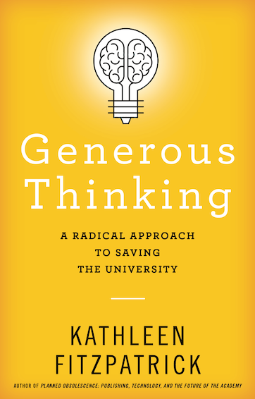

# The Path Forward
---
### The Futures of Research and Graduate Studies
---
 
<smaller>Kathleen Fitzpatrick // @kfitz@hcommons.social // kfitz@msu.edu</smaller> 
<small>http://presentations.kfitz.info/assocdean250410.html</small>

Note: Thanks so much for that introduction, Charlene, and thanks to all of you for joining me here today. I'm grateful to the search committee for their work, and for giving me this opportunity to talk with you a bit about some of my thinking about the futures of research and graduate studies in the college. 

> You should give a 45-minute talk (with 15 minutes for questions) addressing graduate education and grant and research support for faculty and students. The talk should be forward-looking, as much as it can be in these times of uncertainty. We ask that you give specific examples of what you would like to accomplish. In addition, we would like you to talk about how you would overcome the challenges of leading a unit whose research includes the humanities, social sciences, visual arts, performing arts, and interdisciplinary research.

Note: The search committee provided me with this prompt for this talk -- and I want to apologize a tiny bit for starting today with the classic lit-crit move of asking some questions about the prompt, but it's crucial to me to make sure that we're starting the process of thinking together about our collective future with as much of a shared understanding as is possible.

> You should give a 45-talk (with 15 minutes for questions) addressing graduate education, and grant and research support for faculty and students. The talk should be forward looking, as much as it can be in these times of uncertainty. We ask that you give specific examples of what you would like to accomplish. In addition, we would like you to talk about <highlight>how you would overcome the challenges of leading a unit whose research includes the humanities, social sciences, visual arts, performing arts, and interdisciplinary research</highlight>.

Note: So let's start here: I firmly believe that the diversity of methodologies, theoretical approaches, and disciplinary backgrounds represented in the College of Arts & Letters is not a challenge to be overcome, but rather a source of our strength. 

## our <highlight>diversity</highlight> is our <highlight>strength</highlight>

Note: We study our world's cultures and their modes of thought and expression, and we create new contributions to those cultures. We engage with different nations, different languages, different traditions, different communities. We ask different questions and use different methods in seeking answers. And we produce different kinds of work in those engagements. If we approach those differences from a competitive, scarcity-oriented mindset, then yes, our differences become challenges that we need to somehow get past in order to work together. But if instead we approach those differences from a collaborative perspective, with a belief in our collective abundance, then those differences will make us stronger. We can learn from one another, we can share with one another, and we can increase our shared understanding in the process.

<section>
    
    
</section>

Note: This belief is in part the basis for the arguments that I've made in my last two books, *Generous Thinking* and *Leading Generously* -- that, in order to create the best possible conditions for success for the work that we are all committed to doing, we have to do it together, and that "together" requires us all to reground ourselves in collaboration rather than competition, in listening to and learning from one another rather than thinking of our differences as barriers to understanding. I don't at all want to suggest that this is easy -- collaboration is hard, listening and learning are hard, and building and supporting diverse teams are hard -- but that's the work I've committed myself to over the last fifteen years, and that's the work that I hope I will be able to keep doing in the college.

The difficulty of all of this points to another part of the prompt that I want to revisit:

> You should give a 45-minute talk (with 15 minutes for questions) addressing graduate education and grant and research support for faculty and students. <highlight>The talk should be forward-looking, as much as it can be in these times of uncertainty.</highlight> We ask that you give specific examples of what you would like to accomplish. In addition, we would like you to talk about how you would overcome the challenges of leading a unit whose research includes the humanities, social sciences, visual arts, performing arts, and interdisciplinary research.

Note: "These times of uncertainty" turns out to be a massive (and growing) understatement of the situation. Not that it hasn't always been true that we don't know what the future holds -- but trying to look forward right now results in little but uncertainty. We not only don't know what research and graduate studies in the college will look like five years from now not least because we don't know what's going to happen *tomorrow* that has the potential to radically reshape everything about the ways we work as scholars, as artists, as teachers, as mentors, and as colleagues.

# what do we know?

Note: So what do we know? We know that the process of obtaining support for research and creative activity through grant funding has always been difficult -- and we know that it has just gotten a LOT harder. But we also know that there are still opportunities out there, and not just opportunities but enormous *need* for the expertise, the talent, the collaborative potential and the community engagement that CAL brings together. We know that resources are scarce, but we also know that creativity and commitment are not. With all of that in mind, I want to offer both some thoughts about where we are today, and how we'll cope with the months ahead, as well as where I hope that we might be able to go in the future.

## thank you
---
<smaller>Kathleen Fitzpatrick // @kfitz@hcommons.social // kfitz@msu.edu</smaller>

Note: Many thanks.