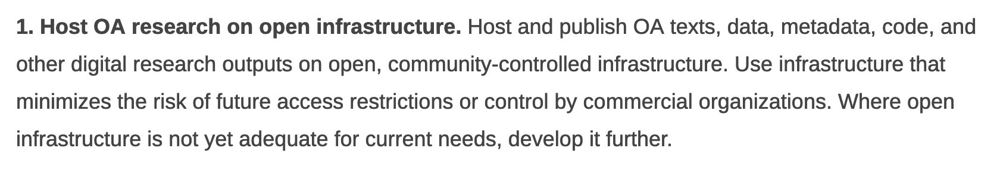
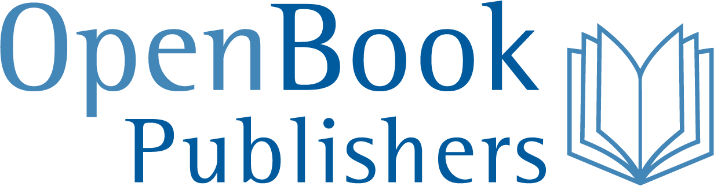
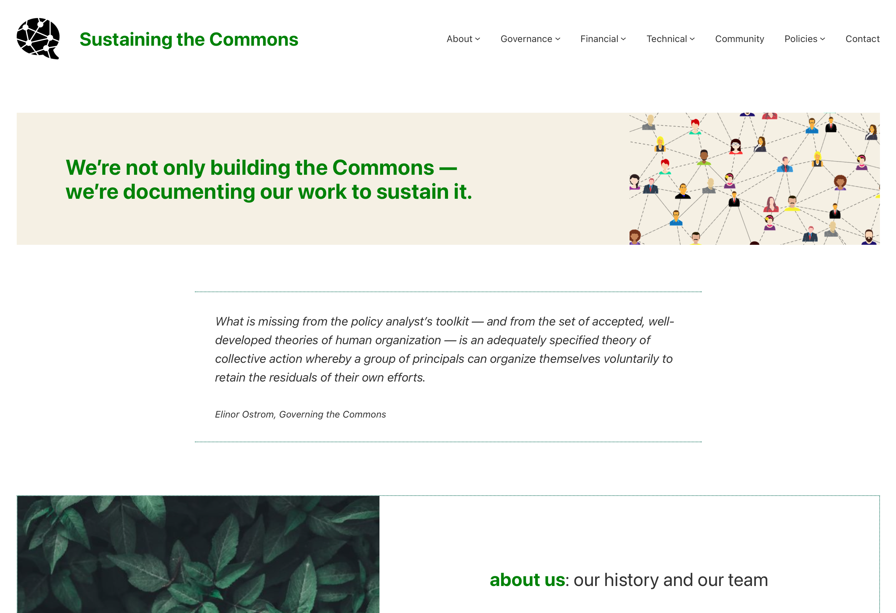
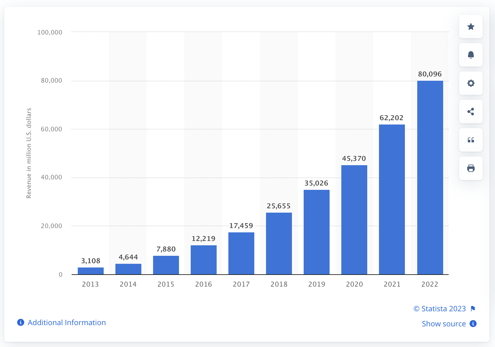
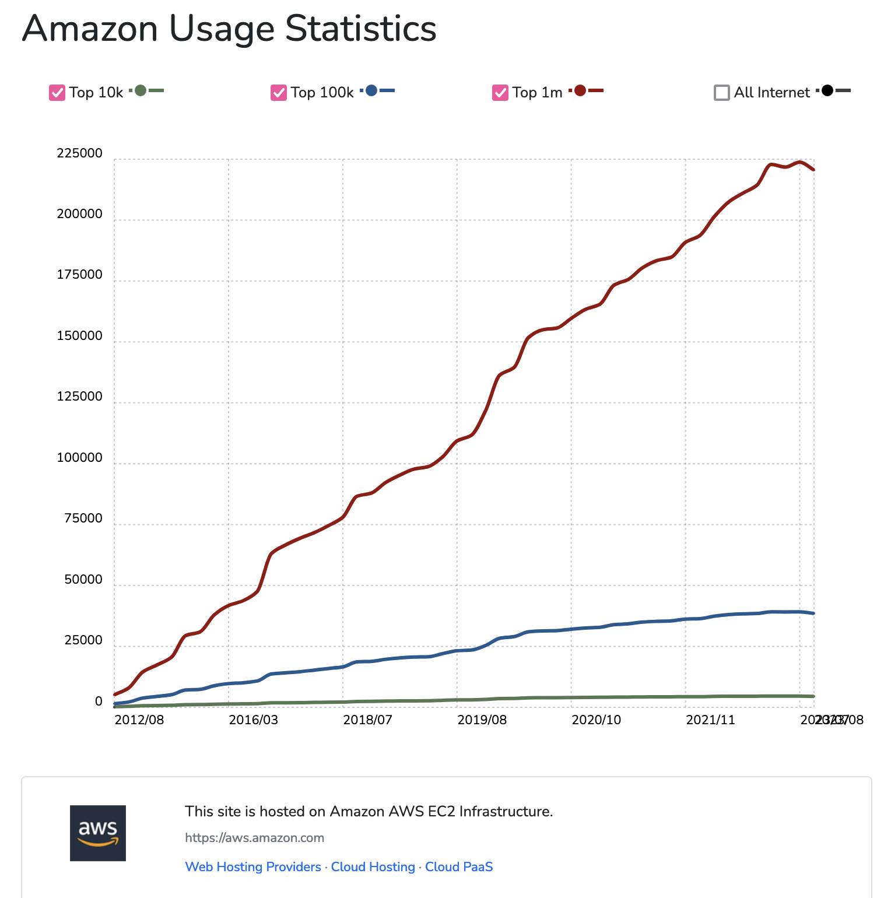
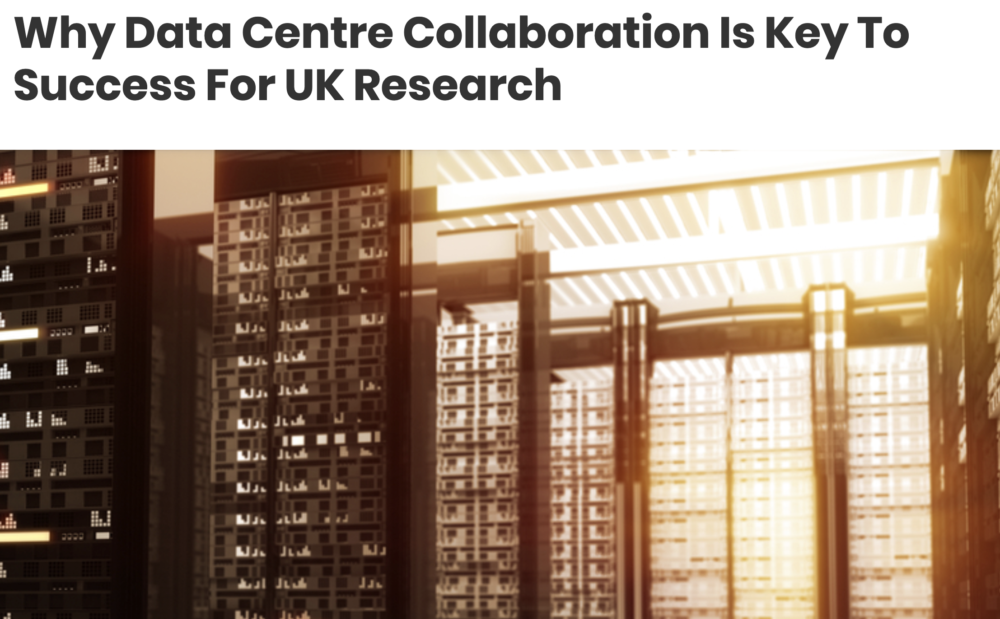

## Open Matters
---
<smaller>Kathleen Fitzpatrick // @kfitz@hcommons.social // kfitz@msu.edu 
DLF Forum 2024 // 17 June 2024</smaller>

Note: Thank you so much. I'm delighted to have the opportunity to welcome you to East Lansing, to Michigan State University, and to Wells Hall. Wells is a key bit of infrastructure for the College of Arts & Letters, housing several of our departments and a whole lot of our classes, and like a whole lot of infrastructures, we mostly don't pay it a lot of attention until things go wrong. This isn't all that unusual.

> “Infrastructural systems are famously boring because the best possible outcome is nothing happening, or at least nothing unexpected or untoward.”
> 
> <small>—Deb Chachra, <em>How Infrastructure Works</em> </small>

Note: As Deb Chachra points out in her brilliant book, *How Infrastructure Works*, “Infrastructural systems are famously boring because the best possible outcome is nothing happening, or at least nothing unexpected or untoward.” The best thing that infrastructure can do is remain invisible and just work. But as Chachra also argues, the shape of our society is dependent on our infrastructure, and where inequities are part of those systems’ engineering, they constrain the ways that society can evolve.

Infrastructure determines whether we can
- foster social and epistemic justice
- empower communities of practice
- enable community-led decision making

Note:  So infrastructure matters, and the infrastructures on which the scholarly community relies in order to build, develop, design, and publish our work have deep implications for our abilities
	- to foster social and epistemic justice in higher education
	- to empower communities of practice and their concerns in the development and dissemination of knowledge, and
	- to enable trustworthy governance and decision-making that is led by the communities that our publications and platforms are intended to serve.
Ensuring these positive outcomes requires commitment to the open, public infrastructures that can enable the work we do in higher education to become actually equitable.

## actually equitable

Note: What do I mean when I say "actually equitable," and how might what I'm describing intersect with the aims of the open access movement? We've heard a lot over the last twenty-plus years about the ways that open access should transform scholarly communication, and it's of course true that a lot has been done to make more research available to be read online. But the movement toward open access began as a means of attempting to break the stranglehold that a few extractive corporate publishers held over the research and publishing process -- and in that, it hasn't succeeded. The last decade in particular has revealed all of the resilience with which capital responds to challenges, as those publishers have in fact become more profitable than ever by figuring out how to exploit APCs, hybrid publishing models, and even whole new business plans like the so-called "read and publish" agreements that keep us tied to them. They've developed new platforms and infrastructures like discovery engines and research information management systems, and all of that serves to increase corporate lock-in over the work produced on campus.

> “We became increasingly clear that OA is not an end in itself, but a means to other ends, above all, to the equity, quality, usability, and sustainability of research. We must assess the growth of OA against the gains and losses for these further ends. We must pick strategies to grow OA that are consistent with these further ends and bring us steadily closer to their realization.”
> 
> <small>—BOAI 20</small>

Note: In fact, by the time the Budapest Open Access Initiative group reconvened in 2022 to celebrate its 20th anniversary, it had become all too obvious that the dominant OA publishing mechanisms that had emerged in the interim had not had the desired impact, leading the BOAI 20 statement to argue that "OA is not an end in itself, but a means to other ends, above all, to the equity, quality, usability, and sustainability of research." Thanks to the resilience of the corporations that control the infrastructure of scholarly communication, open access in its dominant forms today has if anything *reduced* equity, by attaching high fees to the formats and platforms that allow publications to circulate most widely. Scholars whose fields, institutions, or nations do not have ready access to grant funding or other means of subsidizing publishing fees thus get silenced, closed out of participation in sharing their work.

<small>budapestopenaccessinitiative.org/boai20/</small>

Note: It’s for this reason that the 20th anniversary Budapest recommendations led with a call to host open access research on open infrastructure, recognizing that the control of the infrastructure by profit-seeking entities cements inequities – and this is true even where those publishers purport to create opportunities for the disadvantaged by offering fee waivers and discounts on their publishing charges. Those discounts only serve to normalize a model in which it is considered correct for those who produce knowledge to pay corporations to host and circulate it.

## Wait, what?

Note: I want to be super clear about what I mean by that. If it is true that the way things are currently done in the dominant forms of open access publishing today involves author-side fees, those fees, like all of  "the ways things are done" -- have become a normalized part of scholarly communication culture. To call it culture is not to diminish its significance at all. As Peter Drucker has long been quoted as saying,

## "Culture eats strategy for breakfast."

Note: "culture eats strategy for breakfast" in the corporate universe -- which is to say that the normalized, unspoken assumptions about the ways things are done will take precedence over all but the best-laid alternative plans, and because of that *real* strategic change often demands deep cultural transformation as a prerequisite.

## fair use

Note: Take, as an example, the case of "fair use," which as we all know is not a legally defined status with respect to the use of copyrighted materials, but rather a fuzzy affirmative defense posture requiring the defendant to prove their innocence in a courtroom that presumes their guilt. Fair use is a small and eternally at risk exception within a culture that is built on the presumption of the correctness of owner control, in other words. And as Susan Bielstein argues in *Permissions: A Survival Guide,* every time we ask permission to use an image or a quotation in a way that ought to be defensible under fair use, we weaken that exception, and we normalize the dominance of ownership, giving credence to corporate claims that we *ought* to be asking for permission at all times because that's *the way things are done*.

## fee waivers

Note: Open access fee waivers are similarly a precarious exception within a larger culture of corporate control of the mechanisms of publishing. That exception presumes that you *should* pay to make use of their infrastructure, even if in *your particular case* they might bend the rules. Every time we accept a corporate publisher's discount or fee waiver, or make use of a "read and publish" deal, or otherwise use public funds to cover the increasingly ridiculous sums charged in order to circulate the products of research, we help strengthen the argument that it's perfectly normal for corporations to control the flow of knowledge and to profit from doing so.

## ownership matters

Note: All of which is to make the faintly obvious point that ownership matters, and especially when it comes to infrastructure. 

<small>mindthegap.pubpub.org/pub/gei072ab/release/2</small>

Note: As the authors of "Mind the Gap" note, the problem with our current OA model is that corporate publishers still largely control the publishing *infrastructure*. They still own the journals, for instance, and unless the ownership of the journal changes, the infrastructure remains out of our control. All that's changed is the means through which we pay to access it.

## alternatives

Note: So what are our alternatives? We can and should move our journals to nonprofit publishers, but it's important to note that the distinction between "corporate" and "nonprofit" is a vast oversimplification. There are corporations that are actually good actors in scholarly communication space, and there are nonprofits that are really, really not. We need to pay more attention not just to business model but to 

## alignment

Note: *alignment* at the level of our basic values and goals: ensuring that our concerns about equity, about inclusiveness, about the public good are matched by those of the partners with whom we choose to work. We might, for instance, explore the models presented by

<!-- .element height="85%" width="85%" -->

<!-- .element height="85%" width="85%" -->

Note: "platinum" or "diamond" open-access publishers such as the Open Library of the Humanities, or Open Book Publishers. These platforms are working to develop new values-aligned business models for publishing that neither involve restricting access to published texts to individuals or libraries that can pay for them, nor restricting the ability to publish to those with who can cover publishing costs. They instead ask those institutions that can afford to contribute to their ongoing support to do so, thus keeping the platform open for everyone. They appeal to our shared commitments, and they rely on our investment to sustain their work -- and for that reason they remain accountable to us.

## community-led infrastructure

Note: The best such open infrastructures are community-led, rather than investor-led: their purposes are aligned with those of the communities they serve, and they are governed by those communities. And this, as Deb Chachra argues, is the key to developing the sustainable, equitable infrastructures we need for the future:

> “Only community-led networks, whether publicly owned or non-profit cooperatives, even have the potential to incorporate broad-based accountability, long-term thinking, and an ethos of meeting needs.”
> 
> <small>—Deb Chachra, <em>How Infrastructure Works</em></small>

Note: (READ SLIDE) This is what scholarly communication needs today: broad-based accountability to scholars and fields and institutions rather than shareholders; long-term thinking and an ethos of meeting our needs rather than those of investors. Hence the call in BOAI20 for hosting open access research on open infrastructure: infrastructure that is led by us, and accountable to us.

Note: And this is the fundamental orientation and driving purpose of my own project, Knowledge Commons, which originated from a desire to build new avenues for more open, more public, more universally accessible scholarly communication. Knowledge Commons has its deep roots in MLA Commons, which was developed to support communication and collaboration among MLA members, a model that was extended to embrace other fields when we became Humanities Commons. We’ve recently rebranded as Knowledge Commons, in order to better represent our disciplinary inclusivity, but the core remains the same. Knowledge Commons accounts are open to any interested user regardless of institutional affiliation, professional status, or organizational membership, and those accounts are and will remain free of charge. Our goal is to provide a non-extractive, community-led and transparently governed alternative to commercial platforms. Beyond that, however, we want to encourage our users to rethink the purposes and  dynamics of knowledge creation and dissemination altogether, in ways that might allow for the development of new, open, collective, equitable processes of creating and sharing our work that recenter agency with those who are actually doing the work.

<!-- .element height="85%" width="85%" -->
<small>hcommons.org</small>

Note: Knowledge Commons is a multi-functional network supporting collaboration and communication among more than 40,000 researchers and practitioners across the disciplines and around the world. It allows users to create profiles, join discussion groups, build Wordpress websites, and more.

 <!-- .element height="85%" width="85%" -->
<small>hcommons.org/deposits/item/mla:579</small>

Note: Most importantly, the Commons includes an integrated repository system, allowing members to upload and share their work openly and to have the DOIs and other metadata attached to it that render it an accessible, interoperable part of the scholarly ecosystem. (Spoiler alert: we're launching a completely rebuilt and totally turbocharged repository very very soon -- if you'd like a preview, stop by our table during a coffee break!)

 <!-- .element height="85%" width="85%" -->
<small>sustaining.hcommons.org</small>

Note: Knowledge Commons has developed to this point thanks to generous support from the Mellon Foundation, the National Endowment for the Humanities, the National Science Foundation, and several other funders. Sustaining the Commons, however, requires us to become less dependent on grant funding, which as we all know all too well is predominantly project-oriented, and instead to seek the institutional investments that can sustain our day-to-day operations. We offer a range of services -- including hosting a Commons node branded for your institution and its members -- that we hope will inspire such investment. But this model requires us to ensure that our values, purpose, and vision remain at the heart of our work. And so we have a participatory governance structure that enables both individual users and our institutional partners to have a voice in the project's future, we have developed network policies that emphasize inclusion and openness, and we are committed to transparency in our finances, and most importantly to remaining not-for-profit in perpetuity. 

## openness matters

Note: This kind of openness -- not just of the tools but of the operating principles behind them -- matters enormously, not just to ensure that we’re living up to the values that we’ve established for our projects, but to ensure that there’s a worthwhile future for them. Cory Doctorow has gotten a lot of airtime of late for his description of the “enshittification” of the internet, which stems directly from user attention and energy being sucked out of the community and into the pockets of shareholders. 

<small>pluralistic.net/2023/08/06/fool-me-twice-we-dont-get-fooled-again/</small>

Note: Doctorow's argument about enshittification arose in thinking about the decline of Twitter and the damage it has caused, and he's more recently noted his resistance to the new big alternatives like Threads and Blue Sky, which remain walled gardens even as they attempt to benefit from federation. He points to the brilliance and creativity that so many people poured into Twitter, noting that “the only thing worse than having wasted all that time and energy would be to have wasted it —  and learned _nothing_.”

## walled gardens

Note: The problem with walled gardens, after all, is only partly their proprietary technologies, and only partly their ownership. It's largely their governance. It’s not just that the owners of any particular proprietary network might turn out to be racist, fascist megalomaniacs – it’s that we have no control if and when they do. Choosing open platforms means that we as users have a say in the future of the plots of ground we choose to develop. This is especially important for the kinds of work, like knowledge production, that are intended to have a public benefit. It’s incumbent on us to ensure that the gardens we plant aren't walled, that they don't just have a gate that management may one day decide to unlock to let select folks in or out. Rather, we must cultivate ground that is open from the start, open not just to our labor but to our decision-making.

## accountability and responsibility

Note: For Knowledge Commons, operating in the open means that we are accountable to our users and responsible for safeguarding the openness of their work. Together, those two ideals keep us focused on providing alternatives to the many platforms that purport to make scholarly work more accessible but in fact serve as mechanisms of corporate data capture, extracting value from creators and institutions for private rather than public gain.

# but

Note: But even as we work to become a trusted form of open infrastructure, we face our own struggles with the walled garden. And this is where we need to dig down into the dirty underside of our infrastructure, which, as Chachra notes, is usually buried out of view. If we are going to mitigate the inequities created by and sustained through our infrastructures, we have to get busy unearthing those systems and find ways to build new ones. And so:

# AWS

Note: We need to take a hard look at the fact that the infrastructure that Knowledge Commons and so many other open initiatives are built upon is AWS, or Amazon Web Services, part of the Greater Jeff Bezos Empire. Every dollar that we spend to host with them helps to keep that empire running. And run it does!

<!-- .element height="85%" width="85%" --><small>statista.com/statistics/233725/development-of-amazon-web-services-revenue/</small>

Note: Amazon’s revenue derived from AWS passed 80 billion-with-a-b dollars in 2022.

<!-- .element height="60%" width="60%" --><small>trends.builtwith.com/hosting/Amazon</small>

Note: and as of August 2023, AWS hosted 42 percent of the top 100,000 websites, and 25 percent of the top one million – ironically enough including BuiltWith, the site from which these data are made available.

# why?

Note: Why has Amazon become so powerful a force in web hosting and cloud computing? Largely because they provide not just servers but a powerful suite of tools that help folks like us keep our platform stable and secure and enable it to scale with enormous flexibility. AWS provides services that would be more than a full-time job for someone to maintain in-house, and it enables redundancy and global reach at speed. AWS also crucially soothes our institutions' risk management anxieties by moving traffic off-campus. So… it works for us, just as it works for 42,000 of the top 100,000 websites across the internet. But I’m not happy about it. It’s not just that I hate feeding more money into the Bezos empire every month, but that I know for certain that our values do not align. And every so often I have to stop and ask how much good it does for us to build pathways of escape from the extractive clutches of Elsevier and Springer-Nature, only to have those pathways deliver us all into the gaping maw of Amazon?

# ~~alternatives~~

Notes: AWS has a stranglehold on web-based platforms of our size, as we’re too big for a box under the desk, too complicated for a smaller hosting service, and too small for our own data center. And if you don’t want to deal with the risks and costs involved in owning and operating the metal yourself, there just aren’t many good alternatives.

# MSU

Note: Here at MSU, like many other research universities, we have both an institutional data center operated by central IT and a high-performance computing center running under the aegis of the office of research and innovation. The latter can’t really help us, as it’s focused pretty exclusively on computational uses and not at all on service hosting. And the former comes with a suite of restrictions and regulations in terms of access and security –

<!-- .element height="65%" width="65%" -->
<small>cnn.com/2023/08/29/politics/university-of-michigan-cyber-incident-offline</small>

Note: – pretty understandably so, given recent attacks and exploits such as the one that caused our neighbor to the east to disconnect the entire campus from the internet on the first day of classes last fall – but nevertheless restrictions that make it impossible for us to be flexible enough with our work.

## the cloud

Note: And, in fact, central IT strongly encourages projects like ours to make use of cloud computing, given the complexity of our needs and risks we present to the campus. They've even negotiated good contracts for us, and we have our pick! We can use AWS, Microsoft’s Azure, or Google Cloud Services.

Note: I just can’t help but think that it’s a Bad Thing for academic and nonprofit services – services that are working to be open, and public, and values enacted – to be dependent upon Silicon Valley megacorps. We need real alternatives. And just like open access, any discounts or special provisions that commercial providers come up with are certain to increase our lock-in, and increase the level of resources they extract from our campuses.

## community-led infrastructure

Note: So what might it look like for the infrastructure of knowledge production and dissemination to be community-led all the way down? What might enable the Commons to leave AWS behind and instead contribute our resources to supporting a truly shared, openly governed, not-for-profit cloud service?

<small>silicon.co.uk/cloud/why-data-centre-collaboration-is-key-to-success-for-uk-research-165462</small>

Note: Such a collaborative, community operated cloud service is not impossible to imagine. King’s College London and Jisc established the first collaborative research data center in the world nine years ago to help UK institutions achieve economies of scale, to increase energy efficiency, and to reduce costs. Of course, it’s a lot easier to get all the UK institutions of higher education on board with such a centralized initiative, partly because there are fewer of them and partly because they are all centrally funded.

<small>access-ci.org</small>

Note: The NSF funded ACCESS-CI project points in this direction, but the process of getting access (ha ha) to this infrastructure for a project like ours isn’t 100% clear, and it’s also not clear how durable and sustainable such access would be. 

<!-- .element height="85%" width="85%" -->
<small>internet2.edu</small>

Note: Real shared cyberinfrastructure will require a high degree of commitment from a large number of institutions to be viable. So what if an organization like Internet2 that already has such commitment were to offer an alternative – one that was not just developed for the academic community but that would be governed by that community? What if each member institution or organization agreed to contribute access to its existing infrastructure and some portion of its annual maintenance budget to a shared, distributed, community-owned cloud computing center? Could excess capacity then be offered at reasonable prices to other nonprofit institutions or organizations or projects like mine, in a way that might draw us away from the Silicon Valley megacorps? Would our institutions, our libraries, our publishers, and our many other web-based projects find themselves with better control over their futures?

- foster social and epistemic justice
- empower communities of practice
- enable community-led decision making

Note:  None of this will be easy, and much of what I’ve just suggested may – at least for the moment – be a pipe dream. But if we were to be willing to press on anyway, we might find ourselves in a world in which the infrastructures of knowledge production and dissemination can help us foster rather than hinder social and epistemic justice, can empower communities of practice by centering their needs and their work to meet them, and can enable trustworthy community governance and decision-making that can secure a better future for us all.

## thank you
---
<smaller>Kathleen Fitzpatrick // @kfitz@hcommons.social // kfitz@msu.edu</smaller>

Note: Many thanks.
