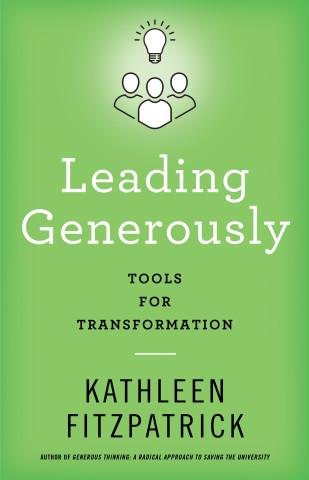
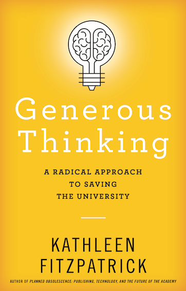

# Leading Generously
---
### Tools for Transformation
---
 
<smaller>Kathleen Fitzpatrick // @kfitz@hcommons.social // kfitz@msu.edu</smaller> 
<small>http://presentations.kfitz.info/fasd250410.html</small>

Note: Thank you so much for that introduction, and HUGE thanks to Marilyn and Cindi for dreaming up this conversation about *Leading Generously*. The origins of this book are seeded both in some questions surfaced by my prior book, *Generous Thinking*, as well as in some of what we as a campus have been through in recent years. I'm not going to re-tell that story here today -- many of you lived it along with me, and if you want to revisit those events I tell at least part of the story in the book's first chapter. I'll just boil it all down to say that in my first seven years as a faculty member here at MSU, we had six presidents and four provosts, and everyone on campus spent a lot of time wrestling with a resulting mixture of anger and despair and exhaustion that seriously inhibited our ability to focus on the things that are most important to us.

## crisis

Note: Calling what we've all been through in recent years -- not to mention what's happening all around us right now -- a "crisis" feels so obvious as to say absolutely nothing. We are surrounded by crisis in the academy (not to mention the world beyond) and while our circumstances at MSU have perhaps been more intense than at other institutions, to say that we have been facing an "institutional crisis" feels redundant. And yet we talk about crisis all the time, especially in the humanities, where we have been in crisis for decades. So part of my goal in *Leading Generously* is to argue that we have at hand some of the means of responding to the crises faced by our fields and our institutions, and that we can demonstrate through the ways that we do our work a better path for the future of the university at large.

Note: This grows in large part out of my previous book, *Generous Thinking*, in which I argued that one way out of this sense of crisis was rebuilding a relationship of trust between the university, its internal communities, and the publics that we serve, all of which would require re-grounding the institution by building community and solidarity both on campus and across the campus borders. This kind of change requires concerted effort to make clear that the real good of higher education is social rather than individual, and renewing that sense of higher education as a public good encourages us to think about the public modes for our work, including community-engaged research and open publishing processes, that might help us better demonstrate the good that we do, especially in hard times. 

# change

Note: But embracing these ways of working requires deep *institutional* change, in order to ensure that work is valued and supported. And it requires not only transforming the ways that we value and reward public work, but also creating the policies that can help us account for and support public work, and adopting the processes and platforms that can bring public work to life. And this is just one piece of the overarching change that our institutions need.

# how

Note: By the time *Generous Thinking* came out, it had already become clear to me that I had some follow-up work to do, that I needed to dig far deeper into the process of and the conditions for transformation. And then after a talk I gave at Virginia Tech in October 2019, an attendee asked a question that's been stuck in the back of my head ever since: generosity is all well and good, she said, and something that's relatively easy to embrace when we're flush, but how do we practice generosity in hard times? Can we afford to be generous when we're facing significant budget cuts, for instance, or is it inevitable that we fall back into analytics-driven competition with every unit -- much less every worker -- out to protect their own resources and their own privileges?

I don't remember exactly how I answered then. I suspect that it was some combination of "you're completely right; that's the real question" and "the difficulties involved in being generous in hard times are precisely why we need to practice generosity in a determined way in good times." And I may have said some things about the importance of transparency in priority-setting and decision-making, and of involving the collective in that process.

But I do know that as I stood there saying whatever I said, I was thinking "wow, this is hard, I don't know." I don't know how we find the wherewithal to remain generous when times are bad, except by having practiced generosity enough to have developed some individual and institutional muscle memory, and by recommitting ourselves to our basic values again and again. And I especially don't know how we remain generous at a moment when our institutions are approaching us — those of us who work for them, as well as those of us who rely on them — invoking the notion of a shared sacrifice required to keep the institution running. I don't know because I want the institution to survive, and I want to maintain the community that it enables, but I also know that the sacrifices that are called for are never genuinely equitably distributed. Sacrifice always rolls downhill, and the only way to prevent it from doing so is to build structures that channel it in other directions.

# leadership

Note: Building those structures -- those ways of being and ways of working together -- is a key component of what I describe as leadership in the book. And new forms of values-enacted leadership are required for us collectively to build a more generous environment in which we can do our work together. In talking about "values-enacted leadership," I want to note that I'm far less interested in radicalizing individual leaders who can rise through the administrative ranks than I am in building cohorts of leaders who can work together to transform those ranks. 

>  “the model of the single leader who carries everything themselves, who is heroic-seeming and so on, is super toxic, and outdated, and not working.” (Interview with Dianne Harris)

Note: This is true not least because, as Dianne Harris (dean of Arts & Sciences at the University of Washington) told me, "the model of the single leader who carries everything themselves, who is heroic-seeming and so on, is super toxic, and outdated, and not working." That heroic model of individual leadership is damaging not just to the institution, whose welfare lies at the mercy of such an executive's successful navigation of an increasingly complex economic, cultural, and political landscape, but also to the well-being of that executive, who must convincingly appear omniscient and invulnerable and who will inevitably fail at pulling that off. We need instead a new framework for academic leadership that is collective and collaborative rather than individual, enabling leadership to become a mode of connection that can be centered anywhere within the org chart where people have ideas about how to make things better. If we can come to appreciate and authorize the collective potential that exists within our institutions, we can begin to make them not only more generous but more resilient.

# collective

Note:  We need a new *collective* model for academic leadership not least because the crises in which our institutions are mired indicate that the model under which we currently labor is irreparably broken. I want to be clear in what I'm saying here: there are some very good people doing the best work they can in many of our campus leadership roles. It's not the people that need replacing, or at least not *all* of the people, and in fact the exercise of replacing them with new leaders with new visions has become a form of institutional deck-chair-rearranging. The problem lies rather with the structures within and through which they work. That's the model of academic leadership we need to contend with, a model with its boards and its presidents and its innumerable vice-presidents that comes to us directly from the hierarchical structures of corporate governance. Those structures are ill-suited to the operation of non-profit entities in general, as can be seen in the extensive recent literature on reimagining non-profit leadership. And those structures are doing grave damage to the purposes of higher education.

## “like a business”

Note: This is why our campus values statements die a little every time that someone says that the university should be run more like a business: because all of our institutions already *are* being run like businesses, and long have been. Of course, what that someone means when they say that the university should be run more like a business is that we should be keeping a closer eye on the bottom line, we should be relentless in our pursuit of innovation, we should be eliminating the product lines that aren't producing sufficient revenue, we should be keeping our front-line labor in check, and so on. All of which we've been subjected to for decades now, and all of which has contributed to the sorry state we're in. 

# competitive

Note: Even worse, however, the unspoken parts of "like a business," the individualist, competitive models for success that are foundational to corporate structures, are actively preventing our institutions from flourishing. This is true not just at the micro-level, where each individual student and employee is required to compete for resources, but also at the macro-level, where our institutions are required to square off in the marketplace rather than develop any kinds of cross-institutional collaborations that could lift the entire sector rather than creating the rankings-driven lists of winners and losers that surround us today.

So here's the core of my argument: universities are not meant to be profit centers, and shouldn't be run that way. They are rather shared infrastructures dedicated to a form of mutual aid, in which those who have -- in this case, knowledge -- support those who need, with the goal of producing a more just and equitable society.  And in that context of collaboration and mutual support, we can start to see that the term "leadership" as it most often gets used a misleading euphemism.

# management

Note: In fact, most of what comes down to us from above is management rather than leadership. Don't get me wrong; good management is crucial to any organization. Management, as John Kotter has argued, is focused on "coping with complexity," on organizing and directing the people and resources necessary to conduct an organization's work. Leadership, by contrast, is a matter of "coping with change." This is a distinction with a difference for Kotter, who has argued that most organizations today are 

## “over-managed and under-led”

Note: "over-managed and under-led," and universities are no exception. At every level of our institutions, we have been disciplined into an inability to cope with -- much less create -- change. Transforming our ideas about campus leadership could allow us to people together to create change, to model and to create the conditions for more thoughtful, more inclusive, more just ways of working. Leadership, in other words, ought to be about building the relationships necessary for collective action. It should be connective, and compassionate, and generative. And it could emerge anywhere in an institution, if cultivated.

# cultivation

Note: I choose the metaphor of cultivation pointedly, thanks to Beronda Montgomery, whose brilliant book _Learning from Plants_ explores the ways that an understanding of botanical life can help us develop more  supportive, more collectively attuned ways of working in human communities. As Montgomery argues, learning from plants encourages us to focus on remediating the environments within which we work together rather than attributing the difficulties some individuals experience in taking root and growing in those environments to internal deficits. This approach also calls upon us to develop a new kind of leadership "vision," one that can

> <smaller>“adapt to changing circumstances, and … enable leaders to see the potential collaborations and benefits in diverse communities. This approach contrasts with the traditional gatekeeping approach, in which leaders determine who gains access via conceptualizations and assumptions about who can function and thrive in a particular context. Instead, this distinct form of leadership is sense driven and environmentally adaptive; it attends to individuals while at the same time tending the ecosystems in which these individuals exist. I call this form of leadership  groundskeeping, in recognition of what we know about the conditions that plants need to successfully thrive.” (Montgomery 149)</smaller> 

Note: **(READ SLIDE.)** Organic metaphors such as groundskeeping and cultivation allow us to think about leadership as something that is grown rather than owned or inhabited, requiring an awareness that our institutions and organization are more akin to ecosystems than they are to the org charts we draw to represent them. Leaders must work in concert with their ecosystems, rather than operating from the top-down management perspective to which we have become accustomed.

# organize

Note: So, reorganizing our institutions around a more organic, collective, collaborative notion of leadership might lay the groundwork for *better* institutions, but how do we get there? In order to get a range of perspectives on that question, I conducted interviews with a number of mid-level managers within their institutions, folks I consider to be leading the process of transformative change. Nearly all of them pointed to the need for collaboration, for listening, for mutual support, and so on, in order to create the ground on which transformation can grow. As Chris Bourg said to me, “The leadership skills for the future of higher education are 100% coalition-building and relationships.” And this is true throughout our institutions: our success at the department level, the college level, the university level, all depends upon our becoming and acting as a collective, on developing and relying on the relationships that can enable us to establish and achieve the shared goals we hold most dear.

Note: So the book is structured in three sections: first, "The Problem," which includes two longish chapters, one focusing on the crisis in higher education and one exploring ideas about leadership deriving from management literature and other sources; second, "The Tools," which has 12 short chapters exploring values-oriented concepts that can help support more generous, collaborative forms of leadership; and third, "The Stories," 5 case studies unpacking particular examples deriving from my interviews that show transformative leadership in action. Whether it all adds up convincingly is I think a matter for the discussion ahead.

## Hope is a discipline.
### *--Mariame Kaba*

Note: But I want to close by saying that I recognize that reimagining leadership in ways that might help guide higher education out of the crises by which it is beset requires a lot in the way of hope for the future. That hope doesn't come easily right now, but as Mariame Kaba has argued, hope is not an emotion, not optimism, but instead hope is a discipline. It's something that has to be *practiced*, day in and day out. And if practiced thoughtfully and well, that hope can be part of developing a future in which higher education can genuinely serve the public good.

## thank you
---
<smaller>Kathleen Fitzpatrick // @kfitz@hcommons.social // kfitz@msu.edu</smaller>

Note: Many thanks.