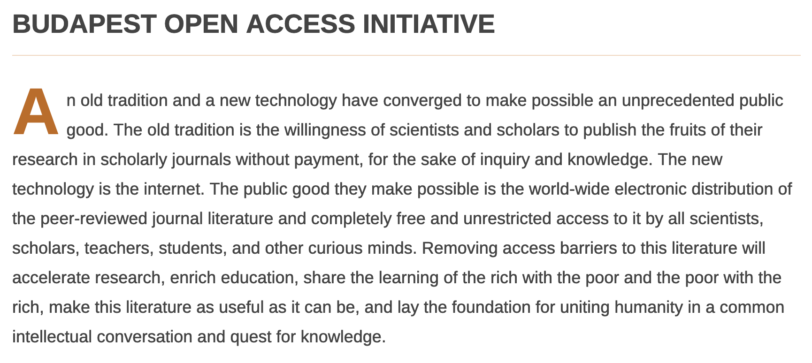
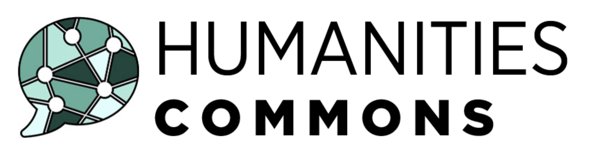
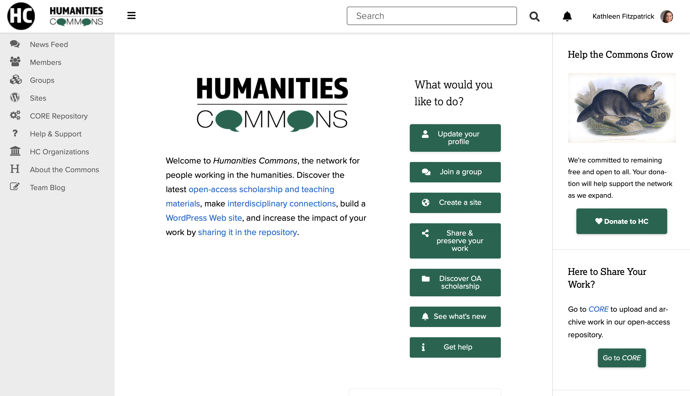
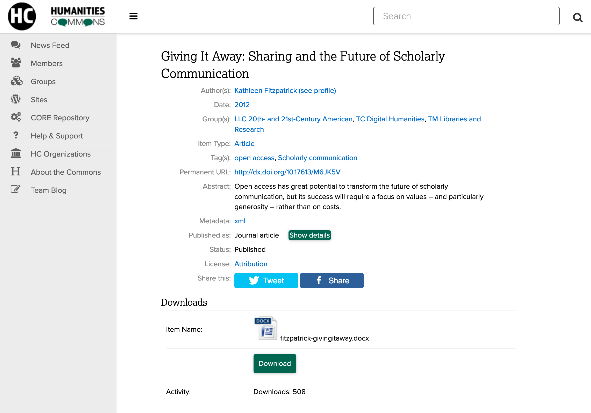
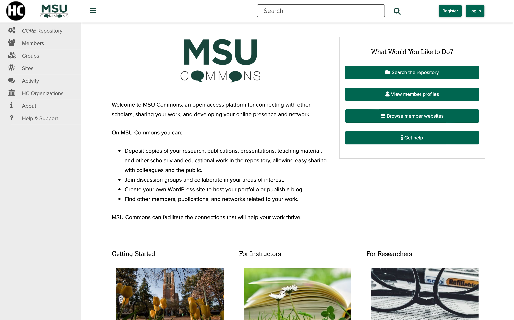
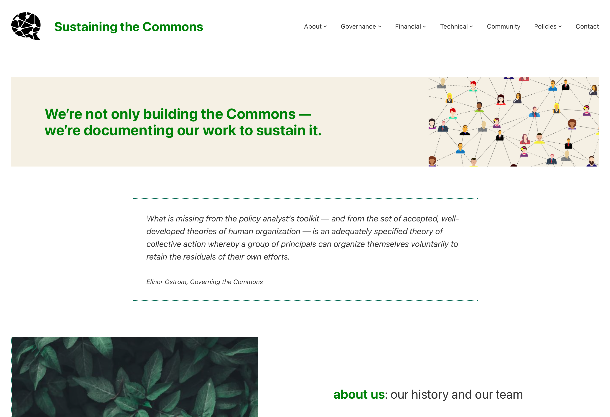
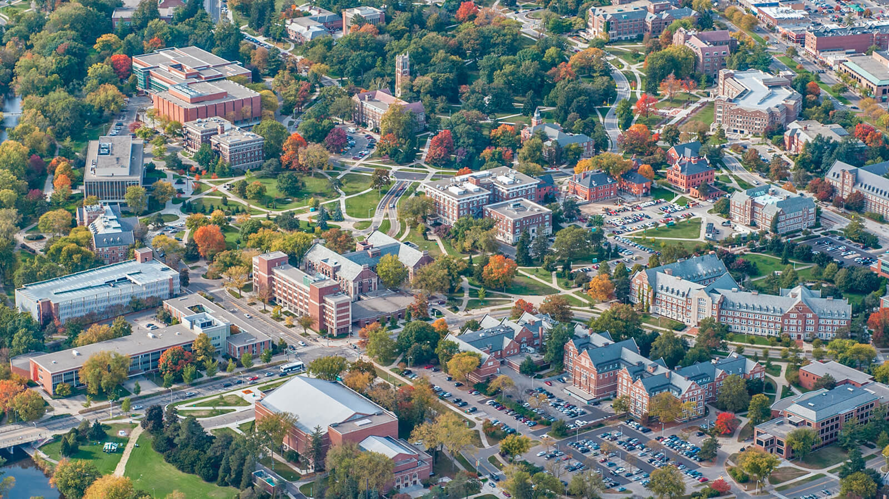
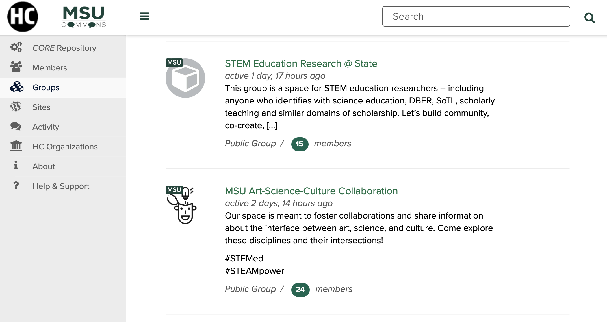
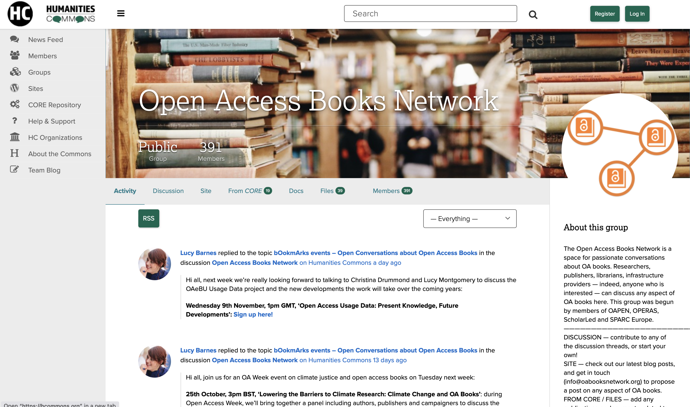

## OA Without Tears 
---
### Platforms and Workflows for Actually Equitable Open Scholarly Communication
---
<small>Kathleen Fitzpatrick // @kfitz@hcommons.social // kfitz@msu.edu 
OAI13 // 6 September 2023</small>

Note: I want to start today by thanking Frank and Wouter for inviting me to speak today as part of this session on Diamond Open Access. My title, as proposed some months ago, is more than a little flippant, but I'm going to start today by raising a few issues that have been worrying me with respect to the present course of open access, before sharing a bit of what my colleagues and I have been trying to do about it. 

- social and epistemic justice
- communities of practice
- community-led decision making
- public investment

Note: I want to start today by pulling out a few common threads in the prior talks:
	- a need to focus on social and epistemic justice in ways that center communities of practice
	- a need to design and develop trustworthy publicly-owned and governed open infrastructure that is flexible enough to serve those widely varying communities of practice
	- the importance of ensuring that decision-making about publishing and its processes are led by the communities those publications serve
	- and underlying all of this the need to secure public investment in truly open initiatives at all levels, in order to ensure that scholarly communication can become actually equitable

## Why is this necessary?

Note: Why is this work -- and this panel -- necessary?
	- open access in its many present flavors has done a lot to make more research available to be read online, but it has done little to reduce the stranglehold that extractive corporations have developed over  research and publishing processes
	- in fact, the development of new models such as "read and publish" and new infrastructures such as discovery engines and research information management systems have only increased corporate lock-in, and not incidentally increased corporate profits as well

<small>budapestopenaccessinitiative.org/read/</small>

Note: Even worse, for a movement that was founded more than 20 years ago in order to make it possible -- as the Budapest statement said -- to "share the learning of the rich with the poor and the poor with the rich, make this literature as useful as it can be, and lay the foundation for uniting humanity in a common intellectual conversation and quest for knowledge," the dominant open access publishing mechanisms that have since emerged have if anything *reduced* equity, by attaching high fees to the formats and platforms that allow publications to circulate most widely. Scholars whose fields, institutions, or nations do not have ready access to grant funding or other means of subsidizing publishing fees thus get silenced, closed out of participation in sharing their learning, and the discounts and scholarships and other fee waivers offered by publishers only serve to normalize a model in which it is considered correct for those who produce knowledge pay corporations to circulate it.

# Wait, what?

Note: I want to be super clear about what I mean by that. The way things are currently done in the dominant forms of open access publishing today involves author-side fees. And that idea -- "the way things are done" -- is what we mean when we talk about culture. To call it culture is not to diminish its significance at all. As Peter Drucker has long been quoted as saying

### "Culture eats strategy for breakfast."

Note: "culture eats strategy for breakfast" in the corporate universe -- which is to say that the normalized, unspoken assumptions about the ways things are done will take precedence over all but the best-laid plans, and because of that  real strategic change often demands deep cultural transformation as a prerequisite.

## Fair use

Note: Take the case of "fair use," which as we all know (at least in the US context) is not a legally defined status with respect to the use of copyrighted materials but rather a fuzzy affirmative defensive posture built of several highly subjective arguments, requiring the defendant to prove their innocence in a courtroom that presumes their guilt.

# Ownership

Note: Fair use is a small and eternally at risk exception within a culture that is built on ownership, in other words. And as Susan Bielstein argues in *Permissions: A Survival Guide,* every time we ask permission to use an image or a quotation in a way that ought to fall under fair use, we weaken that exception, and we normalize the dominance of ownership, giving credence to corporate claims that we ought to be asking for permission at all times because that's the way things are done.

## Fee waivers

Note: Fee waivers, I want to argue, are similarly a precarious exception within a larger culture of 

# Corporate control

Note: corporate control, one that presumes that you should pay even if in *your particular case* they might make an exception. Every time we accept a corporate publisher's discount or fee waiver, or make use of a "read and publish" deal, or otherwise use public funds to cover the increasingly ridiculous sums charged in order to circulate the products of research, we help strengthen the argument that it's perfectly normal for corporations to control the flow of knowledge and to profit from doing so.

# Alternatives

Note: So what are our alternatives? We've heard about several of them over the course of the week so far, and especially today: projects and platforms and publishing workflows that are not corporate-owned, but that rely on public and institutional investment in order to make both publishing and reading freely available to all, and that are accountable to the publics that they serve. And this is the point at which I want to turn from general pontificating to instead talk about my own project...

Note: Humanities Commons originated from a desire to build new avenues for more open, more public, more universally accessible scholarly communication for everyone. In 2013, with support from the Mellon Foundation, the Modern Language Association launched an internally-focused social network, MLA Commons, designed to foster direct communication and collaboration amongst its members. In 2016, we extended that model, again with support from the Mellon Foundation and the National Endowment for the Humanities, to embrace other fields across the humanities, establishing Humanities Commons as a platform for interdisciplinary communication among scholars and practitioners around the world. Account creation is open to any interested user regardless of institutional affiliation, professional status, or organizational membership, and accounts are and will remain free of charge.

# The Goal

Note: Our goal is to provide a non-extractive, scholar-led, academy-owned, transparently governed alternative to commercial platforms. Beyond that, however, we want to encourage our users to rethink the purposes and the dynamics of publishing altogether, in ways that might allow for the development of new, open, collective, equitable processes of creating and sharing knowledge that recenter agency over the ways that scholarly work develops and circulates with the scholars themselves.

<small>hcommons.org</small>

Note: Humanities Commons is a multi-functional network supporting collaboration and communication among more than 52,000 researchers and practitioners across the humanities and around the world. The Commons brings together a large-scale WordPress-based publishing network with the social-networking capabilities made available by the BuddyPress plugin, allowing users to create rich profiles detailing their work, to participate in a wide range of group discussions, and to build individual or group websites that can serve as portfolios, journals, networked projects, and more.

 <!-- .element height="90%" width="90%" -->
<small>hcommons.org/deposits/item/mla:579</small>

Note: Additionally, the Commons includes a Fedora/SOLR-based repository with a WP frontend, allowing members to upload their work, to have DOIs attached it, and to share that work with the broader Commons network.

<small>commons.msu.edu</small>

Note: In 2020, Humanities Commons moved from the MLA to a new fiscal host, Michigan State University, and began work developing the first institutional node on the network, MSU Commons. Over the next two years, we received two significant investments of multi-year support from the NEH and Mellon, allowing us to staff up, to remediate our technical debt, and to develop a forward-looking roadmap toward a sustainable future.

 <!-- .element height="90%" width="90%" -->
<small>sustaining.hcommons.org</small>

Note: Humanities Commons is built by and for scholars. It's a **values-enacted** project, meaning that, among other things, (1) we have put in place a participatory governance structure that enables both individual users and our sustaining institutional members to have a voice in the project's future, (2) we have developed network policies that emphasize inclusion and openness, and (3) we are committed to transparency in our finances, and most importantly to remaining not-for-profit in perpetuity. 

However, becoming sustainable -- rather than remaining dependent on the endless churn of grant support -- requires us to generate revenue that will allow us to continue investing in the network's upkeep. And that requires support from institutions of higher education, which in turn requires us to help those institutions think about the significance of open-source, academy-owned alternatives to the corporate data capture platforms on which they currently rely. The Commons can provide a campus-wide blogging platform, a rich scholarly profile system, and a connected repository -- and it can do so in a space that allows scholars to connect with others in their fields, making the potential for uptake greater.

<small>aerial view, one small part of the MSU campus</small>

Note: But bringing the Commons to institutions requires us to serve the entirety of the campus, not just the humanities. And this is not the usual narrative about innovation in scholarly communication, in which new ideas begin in the sciences and only gradually makes their way into the stodgy print-oriented humanities, where our elbow-patched blazers and dusty archives encourage us to resist everything technical. But last year we were approached by a group of STEM folks on campus who recognized that we've figured out something that they can learn from -- that the values-based approach to building participatory communities we've taken with the Commons is what they need to make their work successful.

# NSF FAIROS RCN

Note: So in 2023, the Commons team was awarded a significant grant from the National Science Foundation in order to extend our model in collaboration with a group of STEM education researchers. We're part of the inaugural cohort of the NSF's FAIROS RCN grantees -- which is how I discovered the NSF's deep love for acronyms. This one is composed of three key parts: 
 - **(CLICK)** first, FAIR, which stands for "findable, accessible, interoperable, and reusable," a set of principles guiding data sharing
 - **(CLICK)** second, OS, or open science
 - **(CLICK)** and third, RCN, or research coordination networks. 
 So the goal for this grant program is to foster networks that coordinate open research according to FAIR principles, all of which aligns quite well with the structures and goals of the Commons.

 <!-- .element height="45%" width="45%" -->
<small>datascience.codata.org/articles/10.5334/dsj-2020-043/</small>

Note: In our proposal, however, we added "CARE" to "FAIR" in describing the work that we're doing.  CARE is a set of principles developed for Indigenous data governance, which applied to our network makes it incumbent on us to ensure that data shared and stored through the Commons are not just findable, accessible, interoperable, and reusable, but are also used for the Collective benefit of those participating in the research, that the communities in which the data are gathered have the Authority to control their use, that the researchers recognize their Responsibility to those communities, and that the relationships, the data, and the platform are all developed with Ethics in mind.

Note: So we're working with our colleagues to develop STEMEd+ Commons, a research coordination network for STEM education researchers worldwide. Our goal is to bring the lessons we've learned in building Humanities Commons -- about the centrality of community-building, about the need for ethical privacy and data reuse policies, and about the significance of strong community governance -- to the future of scientific communication. There are lots of technical updates that this expansion involves -- we're replacing our Fedora-based document repository with an InvenioRDM-based repository that will allow us to better serve a wider range of fields. And we're re-architecting the Commons as a whole, transforming our current hub-and-spoke structure into something more truly federated that will allow our network to connect and interoperate with a wide range of other open platforms and services.

Note: But the key is that the Commons is designed to facilitate **community-building**. Its emphasis on member-to-member connections and communication is a significant component of why our STEM education colleagues came to us, rather than selecting another platform on which they could build their research coordination network -- because while there are a ton of well-funded platforms that can host and preserve the data and publications that scientists produce, many of them are operated without academic values in mind, and none of them focus on the *people* doing the work, or on the ways that discussion and collaboration amongst those people might lead to transformative change.

# change

Note: And this is how we change a culture. Not by starting with the technologies, or the business model, but by starting with the people, and with the culture that connects them. If we are going to develop true open access -- publishing systems that are open both to authors and to readers, not just to contribute and consume products but to genuinely shape the future of the systems themselves -- that's where we need to begin. And that's how we get to OA without tears.

## thank you
---
<small> Kathleen Fitzpatrick // @kfitz@hcommons.social // kfitz@msu.edu </small>

Note: Thanks so much.
