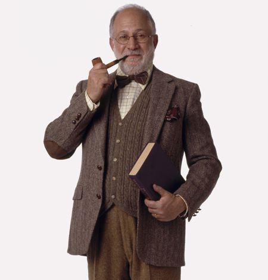

## OA Without Tears 
---
### Platforms and Workflows for Actually Equitable Open Scholarly Communication
---
<small>Kathleen Fitzpatrick // @kfitz // kfitz@msu.edu 
OAI13 
6 September 2023</small>

Note: I want to start today by thanking Frank and Wouter for inviting me to speak today as part of this session on Diamond Open Access. I'm going to start today by raising a few issues that have been worrying me with respect to the present course of open access, before sharing a bit of what my colleagues and I have been trying to do about it.

- social and epistemic justice
- communities of practice
- community-led decision making
- public investment

Note: I want to start today by pulling out a few common threads in the prior talks:
	- a need to focus on social and epistemic justice in ways that center communities of practice
	- a need to design and develop trustworthy publicly-owned and governed open infrastructure that is flexible enough to serve those widely varying communities of practice
	- the importance of ensuring that decision-making about publishing and its processes are led by the communities those publications serve
	- and underlying all of this the need to secure public investment in truly open initiatives at all levels, in order to ensure that scholarly communication can become actually equitable

## Why is this necessary?

Note: Why is this work -- and this panel -- necessary?
	- open access in its many present flavors has done a lot to make more research available to be read online, but it has done little to reduce the stranglehold that extractive corporations have developed over  research and publishing processes
	- in fact, the development of new models such as "read and publish" and new infrastructures such as discovery engines and research information management systems have only increased corporate lock-in, and not incidentally increased corporate profits as well

<small>budapestopenaccessinitiative.org/read/</small>

Note: Even worse, for a movement that was founded more than 20 years ago in order to make it possible -- as the Budapest statement said -- to "share the learning of the rich with the poor and the poor with the rich, make this literature as useful as it can be, and lay the foundation for uniting humanity in a common intellectual conversation and quest for knowledge," the dominant open access publishing mechanisms that have since emerged have if anything *reduced* equity, by attaching high fees to the formats and platforms that allow publications to circulate most widely
	- scholars whose fields, institutions, or nations do not have ready access to grant funding or other means of subsidizing publishing fees thus get silenced, closed out of participation in sharing their learning
	- and the discounts and scholarships other fee waivers offered by publishers only serve to normalize a model in which it is considered correct for those who produce knowledge pay corporations to circulate it

# Wait, what?

Note: So what do I mean by that?
	- "the way things are done" is a deeply ingrained aspect of culture, and as Peter Drucker has long been quoted as saying

### "Culture eats strategy for breakfast."

Note: "culture eats strategy for breakfast" in the corporate universe -- which is to say that the normalized, unspoken ways things are done will take precedence over all but the best-laid plans, and thus real strategic change often demands deep cultural transformation as a prerequisite.

## "Fair use"

Note: Take the case of "fair use," which as we all know (at least in the US context) is not a legally defined status with respect to the use of copyrighted materials but rather a fuzzy defensive posture built of several highly subjective arguments.

# Ownership

Note: Fair use is a small and eternally at risk carve-out within a culture that is built on ownership, in other words. And as Susan Bielstein argues in *Permissions: A Survival Guide,* every time we ask permission to use an image or a quotation in a way that ought to fall under fair use, we weaken that carve-out, and we normalize the dominance of ownership, giving credence to corporate claims that we ought to be asking for permission at all times because that's the way things are done

## "Fee waivers"

Note: Fee waivers, I want to argue, are similarly a precarious carve-out within a larger culture of 

# Corporate control

Note: corporate control: every time we accept a corporate publisher's discount or fee waiver, or sign a "read and publish" deal, or otherwise use public funds to cover the increasingly ridiculous sums charged in order to circulate the products of research, we help strengthen the argument that it's perfectly normal for corporations to control the flow of knowledge and to profit from doing so

# Alternatives

Note: So what are our alternatives?
	- We've heard about several of them over the course of the week so far: projects and platforms and publishing workflows that are not corporate-owned, but that rely on public and institutional investment in order to make both publishing and reading freely available to all, and that are accountable to the publics that they serve.
	- And this is the point at which I want to turn from pontificating to instead talk about my own project...

<small>hcommons.org</small>

Note: A bit of background as I begin: Humanities Commons was launched in late 2016 by the Modern Language Association, with support from the Mellon Foundation and the National Endowment for the Humanities, as a platform for interdisciplinary communication among scholars and practitioners across humanities fields. It extended the model established in 2013 by MLA Commons by adding proprietary instances for a small group of scholarly societies who served as pilot partners, and it connected those instances to a central hub that anyone could join, free of charge, all linked by a shared identity management system that allows users access to the parts of the network where they have active memberships.

# NSF FAIROS RCN

Note: A couple of months ago, the Commons team was awarded a significant grant from the National Science Foundation in order to further extend that model. We're part of the inaugural cohort of the NSF's FAIROS RCN grantees -- which is how I discovered that the NSF loooooooves acronyms even more than my institution does. This one is composed of three key parts: (CLICK) first, FAIR, which stands for "findable, accessible, interoperable, and reusable," a set of principles guiding data sharing; (CLICK) second, OS, or open science; (CLICK) and third, RCN, or research coordination networks. So the goal for this grant program is to foster networks that coordinate open research according to FAIR principles, all of which aligns quite well with the structures and goals of the Commons. What is especially unusual about this grant is that our team, which has "Humanities" right there in the name, was approached by a group of STEM education researchers who wanted to use our platform in order to build their RCN.

Note: There are at least a couple of things that make this surprising: first, that the usual narrative about innovation in scholarly communication is that it begins in the sciences and only gradually makes its way into the stodgy print-oriented humanities, where our elbow-patched blazers and dusty archives encourage us to resist everything technical. And second, that this particular group of STEM folks defied their own usual narrative about the sciences' technological superiority and empirical rationality in recognizing that we've figured out something that they can learn from -- that the values-based approach to building participatory communities we've taken with the Commons is what they need to make their work successful.

Note: The usual narratives have played themselves out time and again in scholarly communication. You might see the history of the open access movement, for instance, which began with the recognition among scientists of the damage that major corporate publishers and their exorbitant journal subscription rates were doing to the dissemination of knowledge. In an effort to create greater equity in access to scientific developments -- and, not at all incidentally, to increase the global impact of work being done in the sciences -- researchers began pressing for alternatives to traditional journal publishing models, such that folks without access to well-funded research libraries would still be able to learn from new publications.

The open-access movement has been driven since the beginning by an astonishingly utopian goal. As the signatories to the Budapest Open Access Initiative claimed in 2002, "Removing access barriers to (scientific and scholarly) literature will accelerate research, enrich education, share the learning of the rich with the poor and the poor with the rich, make this literature as useful as it can be, and lay the foundation for uniting humanity in a common intellectual conversation and quest for knowledge." The idealism that drove this initiative is deeply moving, and it's had a significant effect in changing the ways that scholarly communication operates. Especially in the sciences.

That it's had less impact, and far slower impact, in humanities fields is often read as a sign of our recalcitrance, our backwardness, our refusal to engage with new systems, our desire to keep our conversations exclusive, our grasping after prestige, our general irrelevance to public discourse. 

Note: While there may well be some elements of truth in some of those assessments, what they leave out is a rather stark economic reality: that by and large humanities scholars and humanities publications simply could not afford to take up the call to open access, at least not as it began to manifest itself in actual publications that sought to make work openly available. A huge percentage of those publications managed the transition to open access by shifting the costs from the consumer side, where they had long relied on library subscription fees, to the producer side, where they instead asked authors for article processing charges. This was arguably all well and good in the sciences, where researchers had long written publishing costs into their grants, and where nearly all research is not only grant-funded but funded by grants sizable enough to accommodate such costs. As we know all too well, the vast majority of research done in the humanities is done without grant-based support, and where grants do exist they're usually too tiny to accommodate publishing charges. And while some institutions are able to provide some support for APCs, that funding is neither universally available nor sufficient to accommodate all the researchers that might benefit from it.

Note: So the situation in the humanities, looked at just a little harder, reveals itself not to be exclusive to our fields at all. In fact, the rise of APC-driven business models in scholarly publishing has created new kinds of barriers, preventing many researchers at underfunded institutions, in underfunded areas of research, and in underfunded areas of the world, from contributing to the conversations that open access can foster. In other words, in shifting the costs of publishing from the consumer side to the producer side, the dominant model for open-access publishing didn't eliminate inequities but instead just shifted them, too, turning barriers to access to the products of scholarly research into barriers to participation. (Even more dismayingly, the corporate behemoths that the open access movement rose up against have only seen their profit margins increase during this time, as they've figured out that they can create hybrid journals for which they can *both* charge libraries subscription fees for the journal as a whole *and* charge authors with the ability to pay APCs to make their work openly available.) 

Note: Now, I don't want to suggest that we in the humanities, thanks to our highly developed powers of critical foresight, knew that this situation was coming, and thus that any resistance to open access publishing we might have put up was born out of a principled demand for equity and inclusion. But I will venture that the minimal availability of funding to support this shift to APCs, and thus the less-than-lucrative prospects for publishers who might have hoped to enact the same business model flip in our fields, encouraged those of us who want to promote open access scholarly communication in the humanities to begin thinking about workarounds -- and at least some of those workarounds are potentially more subversive to the business of scholarly communication altogether.

Note: This is where Humanities Commons came from: a desire to promote more open, more public, more universally accessible scholarly communication for everyone.

- I want to talk a bit today about my own project, Humanities Commons
	- for the last ten years, I've been working with colleagues, first within the Modern Language Association, and now at Michigan State University, to develop a non-extractive, scholar-led, and academy-owned and governed alternative to commercial platforms, thus allowing for open, collective, equitable communication processes that give all scholars agency over the ways that work in their fields circulates
	- HC is a bit different: we're not a publisher, or a journal system, but rather a platform that brings together a social/blogging network and a repository in ways designed to facilitate direct scholar-to-scholar communication
- overview of HC functionality
- HC community governance and support

## thank you
---
<small> Kathleen Fitzpatrick // @kfitz // kfitz@msu.edu </small>

Note: Thanks so much.
