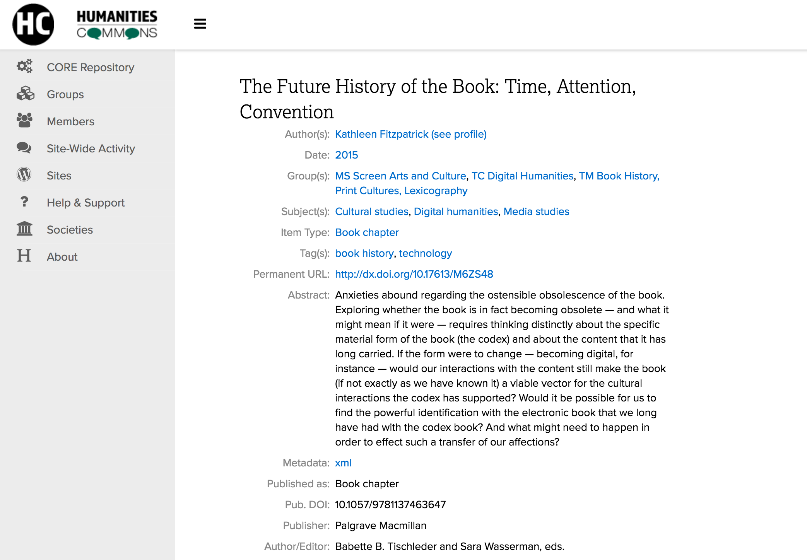

## OA Without Tears 
---
### Platforms and Workflows for Actually Equitable Open Scholarly Communication
---
<small>Kathleen Fitzpatrick // @kfitz@hcommons.social // kfitz@msu.edu 
OAI13 
6 September 2023</small>

Note: I want to start today by thanking Frank and Wouter for inviting me to speak today as part of this session on Diamond Open Access. I'm going to start today by raising a few issues that have been worrying me with respect to the present course of open access, before sharing a bit of what my colleagues and I have been trying to do about it.

- social and epistemic justice
- communities of practice
- community-led decision making
- public investment

Note: I want to start today by pulling out a few common threads in the prior talks:
	- a need to focus on social and epistemic justice in ways that center communities of practice
	- a need to design and develop trustworthy publicly-owned and governed open infrastructure that is flexible enough to serve those widely varying communities of practice
	- the importance of ensuring that decision-making about publishing and its processes are led by the communities those publications serve
	- and underlying all of this the need to secure public investment in truly open initiatives at all levels, in order to ensure that scholarly communication can become actually equitable

## Why is this necessary?

Note: Why is this work -- and this panel -- necessary?
	- open access in its many present flavors has done a lot to make more research available to be read online, but it has done little to reduce the stranglehold that extractive corporations have developed over  research and publishing processes
	- in fact, the development of new models such as "read and publish" and new infrastructures such as discovery engines and research information management systems have only increased corporate lock-in, and not incidentally increased corporate profits as well

<small>budapestopenaccessinitiative.org/read/</small>

Note: Even worse, for a movement that was founded more than 20 years ago in order to make it possible -- as the Budapest statement said -- to "share the learning of the rich with the poor and the poor with the rich, make this literature as useful as it can be, and lay the foundation for uniting humanity in a common intellectual conversation and quest for knowledge," the dominant open access publishing mechanisms that have since emerged have if anything *reduced* equity, by attaching high fees to the formats and platforms that allow publications to circulate most widely
	- scholars whose fields, institutions, or nations do not have ready access to grant funding or other means of subsidizing publishing fees thus get silenced, closed out of participation in sharing their learning
	- and the discounts and scholarships other fee waivers offered by publishers only serve to normalize a model in which it is considered correct for those who produce knowledge pay corporations to circulate it

# Wait, what?

Note: So what do I mean by that?
	- "the way things are done" is a deeply ingrained aspect of culture, and as Peter Drucker has long been quoted as saying

### "Culture eats strategy for breakfast."

Note: "culture eats strategy for breakfast" in the corporate universe -- which is to say that the normalized, unspoken ways things are done will take precedence over all but the best-laid plans, and thus real strategic change often demands deep cultural transformation as a prerequisite.

### Fair use

Note: Take the case of "fair use," which as we all know (at least in the US context) is not a legally defined status with respect to the use of copyrighted materials but rather a fuzzy defensive posture built of several highly subjective arguments.

# Ownership

Note: Fair use is a small and eternally at risk carve-out within a culture that is built on ownership, in other words. And as Susan Bielstein argues in *Permissions: A Survival Guide,* every time we ask permission to use an image or a quotation in a way that ought to fall under fair use, we weaken that carve-out, and we normalize the dominance of ownership, giving credence to corporate claims that we ought to be asking for permission at all times because that's the way things are done

### Fee waivers

Note: Fee waivers, I want to argue, are similarly a precarious carve-out within a larger culture of 

# Corporate control

Note: corporate control: every time we accept a corporate publisher's discount or fee waiver, or sign a "read and publish" deal, or otherwise use public funds to cover the increasingly ridiculous sums charged in order to circulate the products of research, we help strengthen the argument that it's perfectly normal for corporations to control the flow of knowledge and to profit from doing so

# Alternatives

Note: So what are our alternatives?
	- We've heard about several of them today and over the past few days: projects and platforms and publishing workflows that are not corporate-owned, but that rely on public and institutional investment in order to make both publishing and reading freely available to all, and that are accountable to the publics that they serve.
	- And this is the point at which I want to turn from pontificating to instead talk about my own project...

Note: Humanities Commons originated from a desire to build new avenues for more open, more public, more universally accessible scholarly communication for everyone. In 2013, with support from the Mellon Foundation, the Modern Language Association launched an internally-focused social network, MLA Commons, designed to foster direct communication and collaboration amongst its members. In 2016, we extended that model, again with support from the Mellon Foundation and the National Endowment for the Humanities, to embrace other fields across the humanities, establishing Humanities Commons as a platform for interdisciplinary communication among scholars and practitioners around the world. Account creation is open to any interested user regardless of institutional affiliation, professional status, or organizational membership, and accounts are and will remain free of charge.

# The Goal

Note: Our goal is to provide a non-extractive, scholar-led, and academy-owned and transparently governed alternative to commercial platforms. Beyond that, however, we also want to encourage our users to rethink the dynamics of publishing altogether, in ways that might allow for the development of new, open, collective, equitable processes of creating and sharing knowledge that give all scholars agency over the ways their work develops and circulates.

<small>hcommons.org</small>

Note: Humanities Commons is a multi-functional network supporting collaboration and communication among more than 52,000 researchers and practitioners across the humanities and around the world. The Commons brings together a large-scale WordPress-based publishing network with the social-networking capabilities made available by the BuddyPress plugin, allowing users to create rich profiles detailing their work, to participate in a wide range of group discussions, and to build individual or group websites that can serve as portfolios, journals, networked projects, and more.

Note: Additionally, the Commons includes a Fedora/SOLR-based repository with a WP frontend, allowing members to upload their work, to receive DOIs for it, and to share that work with the broader Commons network.

<small>commons.msu.edu</small>

Note: Humanities Commons moved to a new fiscal host, Michigan State University, in 2020, and began work developing the first institutional node on the network, MSU Commons. Over the next two years, we received two significant investments of multi-year support from the NEH and Mellon, allowing us to staff up, to remediate our technical debt, and to develop a forward-looking roadmap toward a sustainable future.

Note: Humanities Commons is built by and for scholars. It's a **values-enacted** project, meaning that, among other things, (1) we have put in place a participatory governance structure that enables users to have a voice in the project's future, (2) we have developed network policies that emphasize inclusion and openness, and (3) we are committed to transparency in our finances, and most importantly to remaining not-for-profit in perpetuity. 

Becoming sustainable -- rather than remaining dependent on the endless churn of grant support -- requires us to generate revenue that will allow us to continue investing in the network's upkeep. And that requires support from institutions of higher education, which in turn requires us to help those institutions think about the significance of open-source, academy-owned alternatives to the corporate data capture platforms on which they currently rely. 

For instance
	- the Commons can provide a campus-wide blogging platform, a rich scholarly profile system, and a connected repository
	- and it can do so in a space that allows scholars to connect with others in their fields, thus making the potential for uptake greater
- but bringing the Commons to institutions requires us to serve the entirety of the campus, and so we're now thinking beyond the humanities

Note: The Commons is designed, in other words, to facilitate **community-building**. Its emphasis on member-to-member connections and communication is a significant component of why our STEM education colleagues came to us, rather than selecting another platform on which they could build their research coordination network -- because while there are a ton of well-funded platforms that can host and preserve the data and publications that scientists produce, many of them are operated without academic values in mind, and none of them focus on the *people* doing the work, or on the ways that discussion and collaboration amongst those people might lead to transformative change.

## thank you
---
<small> Kathleen Fitzpatrick // @kfitz@hcommons.social // kfitz@msu.edu </small>

Note: Thanks so much.
