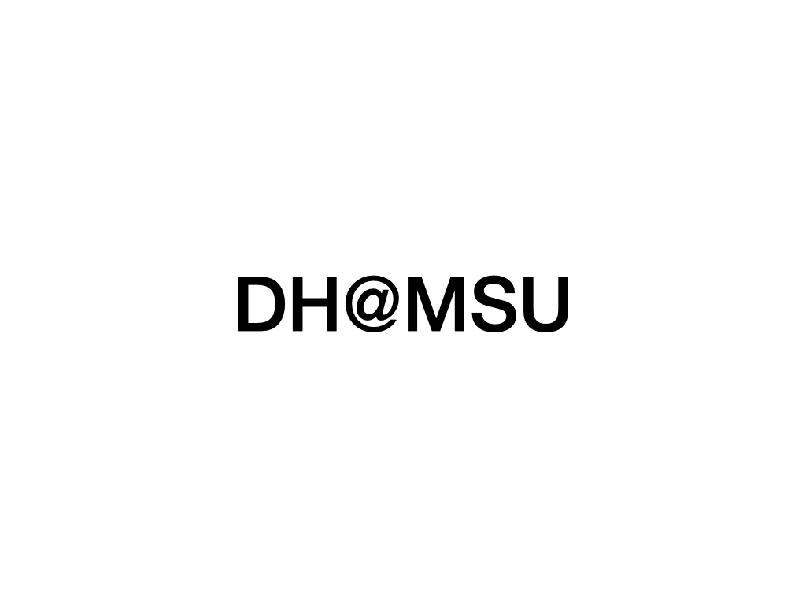
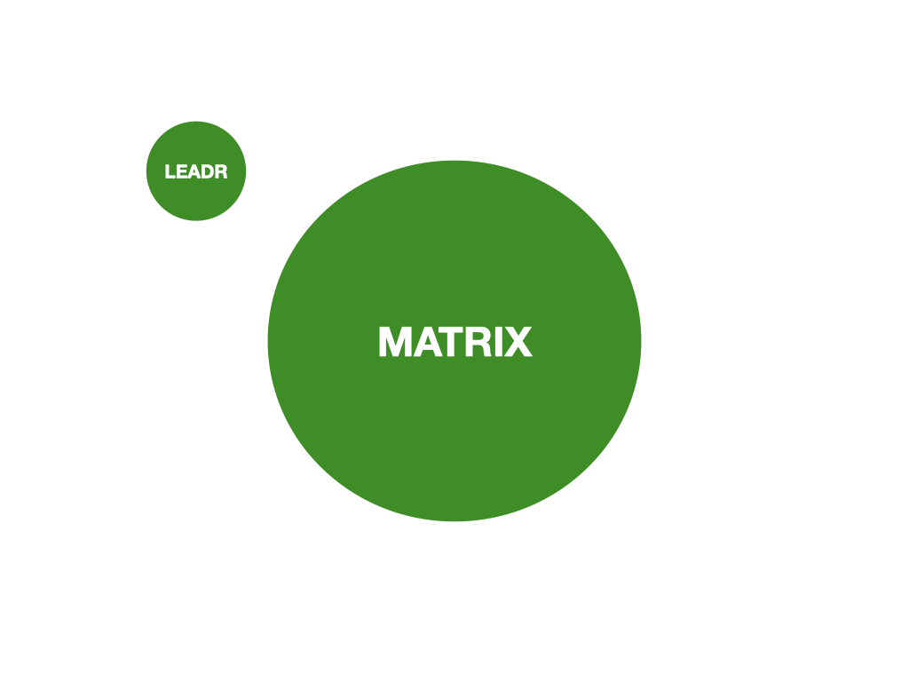
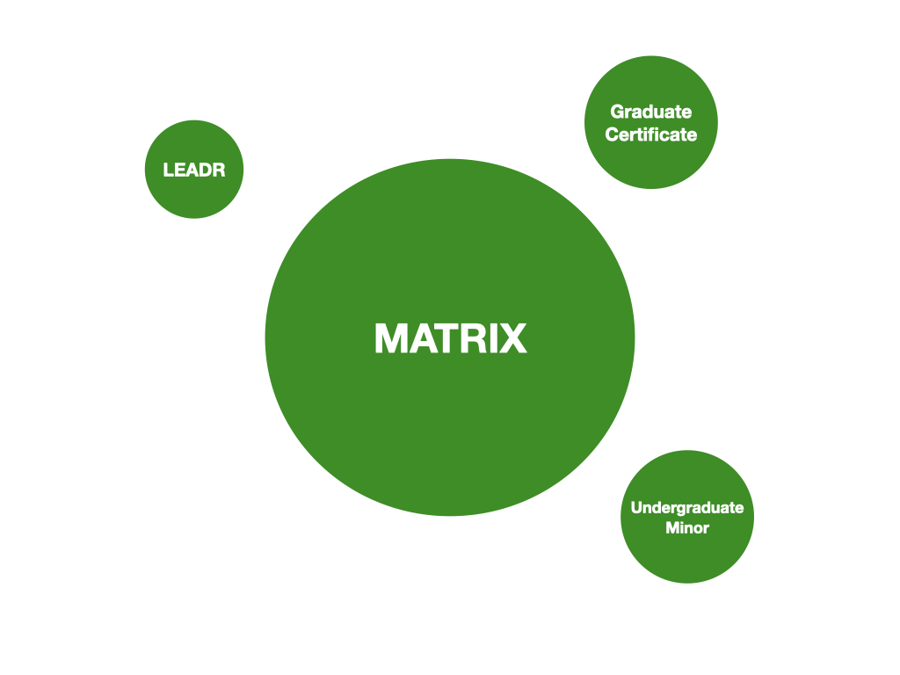
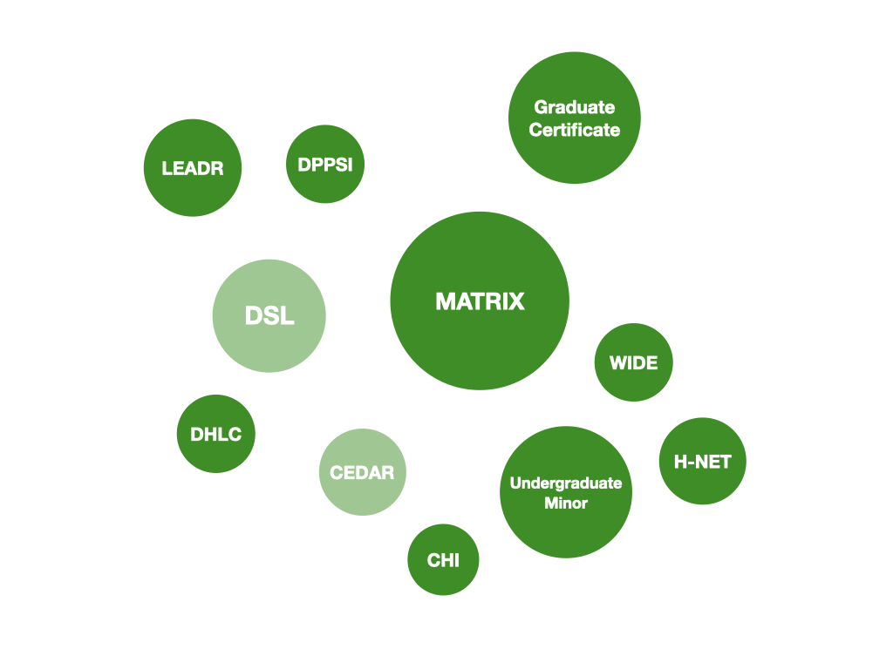
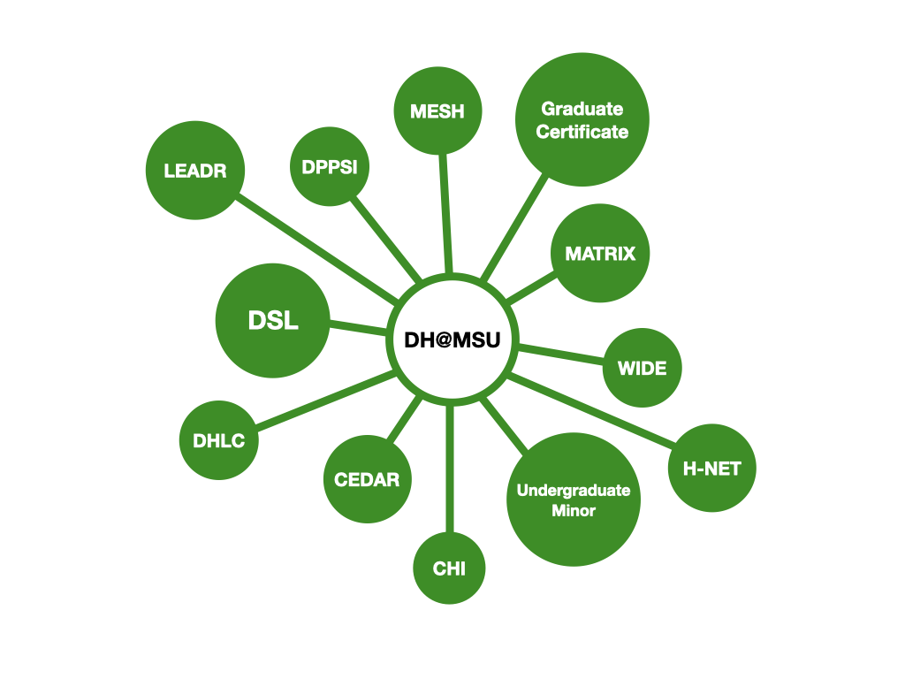

# DH@MSU
---
### What We've Done So Far, and Where We Go from Here
---
<smaller>Kathleen Fitzpatrick // @kfitz // kfitz@msu.edu</smaller>

Note: Hi all. Thanks for taking the time to engage with this review process. I'm grateful to the committee for the time and care they've invested in thinking about the future for DH@MSU. I've put together a number of documents, including a reflection on the accomplishments of the last five years, a vision for our path ahead, a statement of my administrative philosophy, and a DEI statement. The committee has also asked me to put together a talk addressing some aspect of those materials; what I've chosen to focus on here is a little bit of reflection and a little bit of vision: what we've done together in forming the DH@MSU community, and how we might strengthen that community in the years ahead.

Note: Perhaps the first thing to note about DH@MSU is that while some of its particulars have developed recently, what's going on under the hood is far from new. The digital humanities has a very long history at Michigan State, but for most of that history, it developed in idiosyncratic, non-institutional, and often personality-driven ways. When I came to MSU in 2017, I was asked to raise the profile of digital humanities both within the university and on the national scene, not least by creating a sense of structure around it. But walking into a new institution where DH work has been done the way it has been done for more than 30 years and saying "I'm here to direct things!" is risky business, to say the least.

Note: Backing up just a bit: I came to this role from having been the associate executive director and director of scholarly communication at the MLS. I was hired into that role to help the organization think about the ways it might transform its publishing practices for an increasingly digital environment. I learned an enormous amount in that role, but perhaps the most important thing I learned has to do with the difference between management and leadership. I have a lot more to say about that if you're interested, but the key thing to note here is that while good management focuses on bringing out the best in people in order to help a team optimize its processes and achieve organizational goals, changing those processes and goals and getting people on board with moving in a new direction requires a different set of skills. Management, after all, comes with both carrots, in the form of merit raises, and sticks, in the form of disciplinary action. Transformational roles within the academy very often come with neither. And I would be willing to bet that the number of faculty members anywhere who consider themselves to have a "manager" is vanishingly small. So convincing a bunch of established scholars to work together in a focused way toward some kind of vision of change requires an entirely different kind of authority, one built on trust, on relationships, and on listening.

And it was clear when I arrived that I had a lot to learn. I needed a much deeper understanding of the institutional and interpersonal environment that I was entering, not least because, prior to interviewing for this position, this is what I knew about MSU's DH environment: 

Note: MATRIX, one of the oldest and most successful DH centers in the US, and LEADR, a lab that I knew had some kind of relationship with MATRIX, sort of, and that was mostly student-facing. As I moved into the interview process, I did enough research to figure out that 

Note: there was also an academic program in DH, offering both an undergraduate minor and a graduate certificate, but there was so much more I needed to know. 

Note: There were projects that I'd known for a long time, like H-NET, but had no idea they were housed at MSU. There were labs like the DHLC that I knew were there but didn't really understand and hadn't connected to the overall DH picture, and groups like WIDE that I hadn't known about. And there were new spaces and projects coming into being, including the Library's DSL and the College of Arts and Letters's CEDAR collaborative. And amidst this alphabet soup, the relationships among these units was not at all visible to me.

My running joke for the first several months in the position was that my job consisted mostly of having coffee. I reached out to everyone that I could think of within the DH scene at MSU -- present and former directors and associate directors of these labs and centers, faculty with digital projects, administrators, and so on -- and set up time to chat. I asked each of them to tell me the story of the digital humanities at MSU -- how their center or lab or project came to be, how it fit in (or did not fit in) with the other such entities on campus, how it had evolved over time. I asked them what they felt was necessary to creating a more holistic environment for DH within the institution, and where they felt the chief roadblocks to such interconnection and collaboration lay. I also asked them who else I should be talking to, and then talked to them. 

Note: This process allowed me to understand and appreciate the work that had gone into making DH at MSU what it had become, as well as the institutional and interpersonal challenges involved in making it something more. Those two things -- the institutional and interpersonal -- were of course deeply entwined, not least because while I'd been asked to get the existing labs and centers and projects and programs at MSU to cooperate and collaborate, I had neither carrots nor sticks to make that happen. I couldn't offer tantalizing new resources that would make such collaboration appealing, nor did I have any authority to force the issue. I needed to work by creating community, and so needed to get to know the people involved as well as I could.

<smallish>"I don't want to say that everything magically falls into place once you have formed the basic community of people and ideas, but it's staggering how all of the decisions that so obsess people trying to build a center follow logically and inexorably from the evolving needs and expanding vision of more-or-less informal gatherings of like-minded enthusiasts."</smallish>

<smallish>——Stephen Ramsay, "Centers of Attention"</smallish>

Note: Steve Ramsay, in his essay "Centers of Attention," begins from this idea -- that centers are people -- and encourages those who are longing for a DH center on their campus to begin simply by working together. READ SLIDE. As Steve would readily acknowledge, there's a lot of labor hidden between the phrases in this sentence. My round of coffees was one component of that work, but it mostly created one-to-one connections between me and my new colleagues. Forming a community required something different. So in September, I invited everyone that Kristen and I could think of to a community meeting to discuss the future directions for DH and to see what we might want to do together. If I'm remembering correctly, around 25 colleagues came to that meeting and discussed paths forward. In the course of our conversation it became clear that while lots of prior work had been done, there wasn't yet a connective structure within which this large group of people could make the potential for collaboration a part of their ongoing institutional lives, nor was there an institutional structure that could help facilitate the process of making those potential collaborations actual. So we collectively decided that one of our first orders of business should be defining the parameters of our work together. Four volunteers came together with me over the course of a semester to draft a set of bylaws defining DH@MSU and the structures that would support and facilitate our community.

Note: Bylaws give every appearance of being the the least idealistic genre in which one can write, all legalese and densely numbered sections and sub-sections preparing them to be cited in an array of procedures we should all hope we never have to participate in. But they have the potential to be wildly idealistic as well, defining the best possibilities for our work together. And they have to be written to define us at our best, because they set the standard for a lot of ensuing activity, and they define both who we are and how we want to work together.

In re-reading the bylaws for this review, however, I realized that there are some ways in which we're not quite living up to them. For instance, we state that a formal meeting of the core faculty is to be held once per semester, and we haven't held one of those in a few years. We hold several events annually that are intended to bring the entire community together, including our THATCamps and our end-of-semester celebrations. But this moment of return to our governing document has encouraged me to wonder what initiatives we might press forward with if we were to meet more formally as a faculty.

The key problem, of course, is time: especially now, after nearly two years of COVID, we're all overstretched, and the idea of adding one. more. meeting. is just more than most of us can bear. We're already facing a bit of fray in our governance fabric, as it is: all of our core faculty have primary appointments elsewhere, and the time you give us is an extra bit of labor. That you give it demonstrates your real commitment to DH@MSU and what it can do, but that commitment of necessity comes at the end of a long list of other commitments. And if I'm being honest, something similar is true of me: though my appointment is 45% administration, that 45% can only be spread so thin. As a result, most of our initiatives have been slower to develop than I'd like, but we're inching toward them. Key among those initiatives is developing a map of sorts for DH@MSU. 

Note: When we first created the structures within which we now operate, DH@MSU looked something like this -- we'd recently added two new units to our confederation, the DSL and CEDAR, and we would soon add my own R&D unit, MESH. All of these projects and spaces were created in order to fill gaps in the DH landscape at MSU, to provide more support for more kinds of work being done across the field. But there are still institutional puzzles to be solved. For instance, if I have a project and I want to hire a student or two to work on it with me, where might I find funding for that? And how do I hire that student? If I need a higher level of developer support, is there a group of programmers somewhere that I can work with? It's these kinds of questions that often drive the desire for formal centers, but as you can see we've got a pile of centers and still can't fully meet the need. Some of these centers, like MATRIX and the DHLC, are focused on internally generated grant-funded projects and aren't able to support external projects. Some, like the DSL, have constituencies that are so broad that they can't go deep on many projects. And all of them face similar questions about the full lifecycle of projects: How are they incubated? How do they get past the incubation stage and into full development? How can their teams obtain not just the funding but also the training they need to be self-sufficient? How are projects hosted and maintained over the long-term? And once those projects are no longer viable, what provisions can we make for flattening and archiving them?

Note: In order to answer these questions, and more, we're currently working on two fronts: first, to map all of the resources within MSU that the DH community should know about -- the funding sources, the training opportunities, the support services, and more. And second, we're working to pull together the research units within DH@MSU with the other units on campus -- like EDLI, the Enhanced Digital Learning Initiative -- that have some of the same questions. We're hoping to build out additional layers of consortium, first, within the humanities and social sciences via what we're currently calling the Consortium for Digital Scholarship and Practice. 

Note: We're also working at a second level, across the university, via the Research Facilitation Network, bringing together related groups in quantitative fields, in the bench sciences, and in university-level enterprise computing. This superstructure, led by the MSU Libraries, central IT, and the Office of Research and Innovation, will be crucial to ensuring that the most important forms of research infrastructure are just as available to scholars in the humanities as they are in the sciences.

Note: Okay, so we've now zoomed out from the constellation that is DH@MSU to the galaxy that is the Research Facilitation Network. And I've told you a bit about my journey along the way. But I'm guessing you might like me to boil this down into a few conclusions that we can think about as we move forward. So:

1. Remember Steve Ramsay's claim -- centers are people -- but focus on the connections among those people.

Note: READ SLIDE. Getting DH@MSU to where we are, and pushing us along to where we need to be, is all about building relationships among the different folks with a stake in the collaborations that we hope to facilitate. Along which lines:

2. Informal relationships are a great place to begin, but formal structures for those relationships can make them institutionally durable.

Note: READ SLIDE. How can we continue to define the connections among independent units and projects that allow them to maintain their independence while leveraging their combined strength? This is especially important when we're trying to do the work of creating something coherent without a substantial budget or a top-down administrative mandate. And finally:

3. Networks might facilitate the development of new, spontaneous connections in ways that centers cannot.

Note: READ SLIDE. Networks can both harness the power of informal relationships and allow their impact to extend outward, drawing strength from the combination of resources and knowledge that all of their participants bring to bear. Networks are also more flexible than centers, in that they can accommodate new developments, shifts of direction, and so on in ways that solid structures cannot.

## thank you
---
 <smaller>Kathleen Fitzpatrick // @kfitz // kfitz@msu.edu</smaller>

Note: So: that's pretty much where I am right now, and I'm sure I've opened up way more questions than I've answered. Thanks for watching this, and I'll look forward to hearing your questions as this process moves forward.
