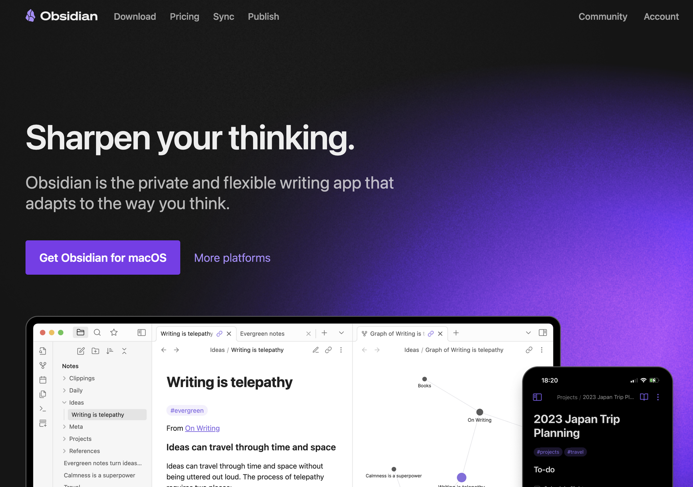
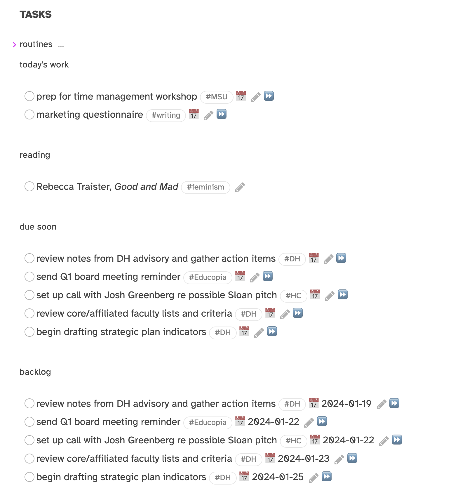
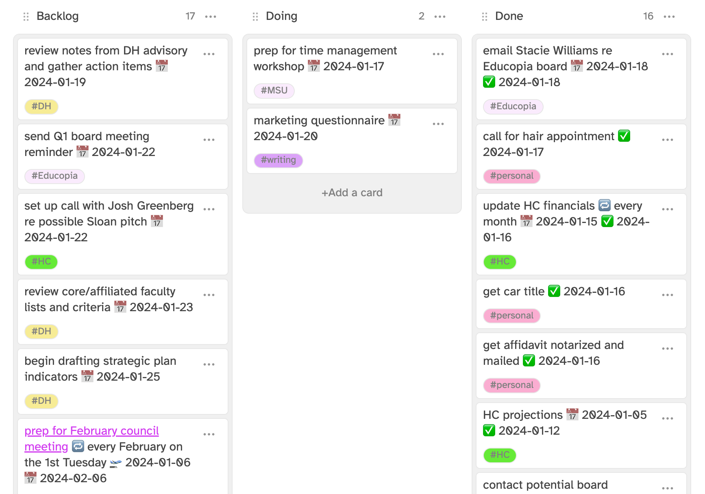

## Time Management 
### for Overworked Mortals
---
<smaller>Kathleen Fitzpatrick // @kfitz@hcommons.social // kfitz@msu.edu 
MSU OFASD Leadership Institute // 19 January 2024</smaller>

Note: Thank you so much. I’m super happy to get to share a few ideas with you about how to deal with the overflow of stuff facing you in your professional lives. I have to begin, however,

# YMMV

Note: with a great big caveat: Your Mileage May Vary. Which is to say that there is a ton of advice circulating, and you’ll get a bunch of it here today too, and lots of that advice is good but not all of it will work for you. On email management, for instance: lots of people will tell you that you should only check your email a couple of times a day. And I get that: if you can really, genuinely ignore your inbox other than during those times, it opens up a lot of brain space! But that would never in a million years work for me, and I can feel my heart rate climbing just contemplating it – I cannot bear not knowing what’s piling up in my inbox while I’m not looking. What I would instead suggest is that you need to figure out your own best work flow – which times of day are most productive for you, for what kinds of work, and what methods of time and inbox management work best for you. And all of that requires a fair bit of experimentation.

## Email
- Don’t use your inbox as a to-do list.
- Get rid of the small stuff quickly.
- Move the bigger stuff into a proper to-do system.
- Use other tools as much as possible.

Note: So, with that said, a few thoughts on email. As my co-panelists have said/will say, I have found that using my email inbox as a to-do list is a HUGE error, not least because I start breaking out in hives when my inbox has more than about ten things in it, and my to-do list is ALWAYS longer than that. Not to mention that when the list of things in my inbox gets long enough that I have to scroll, I'm going to start forgetting stuff. My brain is a little simple that way: if it's not right in front of me, it doesn't exist. So I try to deal with email as quickly as I can. If a message can be dealt with in less than a minute or so, I try to take care of it right away, unless I'm in a period of focused work. If a message requires more consideration than that, or if it requires me to do something, I get it into my to-do workflow and either archive the message or use the Snooze function to have it reappear in my inbox at a point when I can deal with it. And as I think my colleagues will also say, I try to move as much internal communication out of email as possible. My research team and related colleagues rely heavily on Teams for most of our quick communication.

# To Do

Note: My to-do workflow has changed a lot in the last few years. I used to use Things, which had Mac and iOS apps and really good organizational mechanisms. But then a couple of years ago, I started using Obsidian for note-taking.

Note: Obsidian is a free application that allows you to use Markdown, which is a very simple formatting method, in order to create rich notes in plain-text format. It’s a powerful replacement for something like Evernote or OneNote, applications that use a proprietary format that keep your notes locked in. Since your Obsidian notes are just plain text, and because they all stay on your local machine in a regular folder that you designate, you can easily switch to another application if you want. Obsidian is not an open-source platform -- the primary code base is maintained by its own team -- but it is open to community extension, and so hundreds of Obsidian users have created open-source plugins that add all kinds of functionality to the base platform.

<!-- .element height="65%" width="65%" -->

Note: One of those plugins is Obsidian Tasks, which is now the center of my workflow. Obsidian Tasks recognizes that you often create “to do” items for yourself in the course of taking notes on a meeting or planning out a project. Those items live wherever you create them, so you can see them in context, but Tasks uses queries to gather any items that have checkboxes like these and that fit whatever parameters you set (like having a particular due date, or a particular hashtag) into a single place, regardless of where it originated.

<!-- .element height="85%" width="85%" -->

Note: I also use a plugin called Kanban that allows me to see and order all the stuff I need to do (my backlog), the stuff I'm planning to do today, and the stuff I've completed in ways that help me visualize what’s ahead and drag tasks into new orders as their priority shifts. There’s also a plugin called ICS that allows me to pull my daily schedule in from my calendar.

<!-- .element height="85%" width="85%" -->

Note: And finally I use the Daily Notes function with a template that compiles my schedule, my to-dos for the day, and space for the day's journaling and meeting notes. 

## That’s a lot.

Note: I want to acknowledge that my process is SUPER overkill for most people, and mostly reflects the geeky pleasure I derive from fiddling with my organizational tools. This will totally not work for anyone who doesn’t like a little bit of fiddling – but there are tons of tools out there that will allow you to create your tasks and get the reminders you need of the things you need to do.

## You do you(r best workflow).

Note: Which brings me back to my point that you really need to think through how you work and what you need from your workflow. One thing I know I need is to be sure that absolutely everything is captured in my to-do workflow, because if it's not there I won't remember it -- or rather, I will remember it, at 2am in a cold sweat -- so I make sure that I create a task for everything as it arrives in my email, or in Teams, or in a meeting. I also know that I need to protect blocks of time for reading, writing, and thinking, and that I do my best focused work first thing in the morning, before the day interferes, so I have blocked off the 8am to 10am block on my calendar for focused work, and only interrupt that time for college-level and higher meetings or special events like this one! I also try to preserve time on my schedule for exercise, knowing that it's the first thing I'll give up when things get busy, and that I need the exercise to bring my stress levels down. And I know from experience that I am no good at all after 5pm, so I try to be sure things are shut down before then.

## Daily/weekly practices

Note: So every morning, as early as I can get myself to sit down at my desk, I create my daily note and do a bit of journaling, reflecting on the days before as well as the day ahead, and then turn to whatever the primary thing I need to focus on it, before the meetings start. And every Sunday, I review the week that's just ended, as well as the week ahead, to get myself oriented to what's ahead.

## Process

Note: My process is far from perfect, and I’m not always as on top of things as I’d like to be. (Case in point: I finished these slides at 8:45 this morning.) But knowing what I have to do, and knowing that it’s all accounted for, that things won’t fall through the cracks, really helps me keep my anxiety at bay, and honestly, that’s a lot.

## thank you
---
<smaller>Kathleen Fitzpatrick // @kfitz@hcommons.social // kfitz@msu.edu</smaller>

Note: Many thanks.
