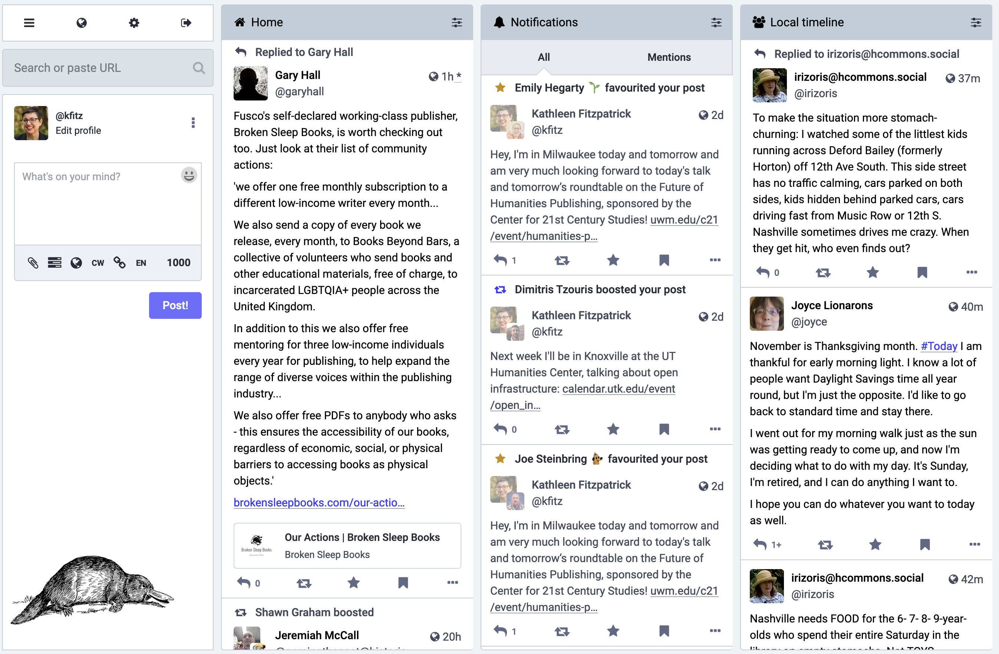

## Open Infrastructures 
### and the Future of Knowledge Production
---
<smaller>Kathleen Fitzpatrick // @kfitz@hcommons.social // kfitz@msu.edu 
University of Tennessee // 6 November 2023</smaller>

Note: Thank you so much. I'm delighted to have the opportunity to be with you here today, and to share some of the thinking that my team at MSU and I have been doing about the ways that the future of knowledge production depends upon the openness of the infrastructures that support our work. And I know that for a lot of people, the word "infrastructure" triggers a yawn reflex -- like, oh great, a technical talk, do I really want to hear a lot about this? 

> “Infrastructural systems are famously boring because the best possible outcome is nothing happening, or at least nothing unexpected or untoward.”
> <small>—Deb Chachra, <i>How Infrastructure Works</i> </small>

Note: If that's your reaction, you're not alone. As Deb Chachra points out in her brilliant new book, *How Infrastructure Works*, ""Infrastructural systems are famously boring because the best possible outcome is nothing happening, or at least nothing unexpected or untoward." The best thing that infrastructure can do is remain invisible and just work. But as Chachra also argues, the shape of our entire culture is dependent on our infrastructure, and where inequities are part of those systems' engineering, they constrain the ways that culture can evolve.

- social and epistemic justice
- communities of practice
- community-led decision making
- public investment

Note:  What I'm hoping to argue today is in large part that the scholarly communication infrastructures on which we build, develop, design, and publish our work have deep implications for our abilities
	- to work toward social and epistemic justice
	- to center communities of practice and their concerns
	- to enable trustworthy governance and decision-making that is led by the communities that our publications and platforms are intended to serve
	- and to secure public investment in order to ensure that scholarly communication can become actually equitable

## actually equitable

Note: What do I mean by "actually equitable," and how might what I'm describing intersect with the aims of the open access movement? We've heard a lot over the last twenty-plus years about the ways that open access should transform scholarly communication. If our work could be read more openly by anyone, it's been said, it might both have more impact on the world at large and create a more equitable knowledge environment. And it's of course true that open access in its many present flavors has done a lot to make more research available to be read online. But the movement toward open access began as a means of attempting to break the stranglehold that a few extractive corporate publishers have established over the research and publishing process -- and it hasn't succeeded. The last decade in particular has revealed all of the resilience with which capital responds to challenges, as those corporate publishers have in fact become more profitable than ever. Not only have they figured out how to exploit article processing charges in order to make *some* work published in their journals openly available while continuing to charge libraries for subscriptions to the journals as a whole, but they've also developed whole new business plans like the so-called "read and publish" agreements that keep many institutions tied to them, and they've developed new platforms and infrastructures like discovery engines and research information management systems that serve to increase corporate lock-in over the work produced on campus.

<small>budapestopenaccessinitiative.org/read/</small>

Note: The open access movement was founded more than 20 years ago in order to make it possible -- as the original Budapest statement said -- to "share the learning of the rich with the poor and the poor with the rich, make this literature as useful as it can be, and lay the foundation for uniting humanity in a common intellectual conversation and quest for knowledge." By the time the Budapest group reconvened in 2022 to celebrate its 20th anniversary, it had become all too obvious that the dominant open access publishing mechanisms that had emerged in the interim had not had the desired impact.

> “We became increasingly clear that OA is not an end in itself, but a means to other ends, above all, to the equity, quality, usability, and sustainability of research. We must assess the growth of OA against the gains and losses for these further ends. We must pick strategies to grow OA that are consistent with these further ends and bring us steadily closer to their realization.”
> <small>—BOAI 20</small>

Note: (READ SLIDE.) To put it a bit more plainly, thanks to the resilience of the corporations that control the infrastructure of scholarly communication, open access in its dominant forms today has if anything *reduced* equity, by attaching high fees to the formats and platforms that allow publications to circulate most widely. Scholars whose fields, institutions, or nations do not have ready access to grant funding or other means of subsidizing publishing fees thus get silenced, closed out of participation in sharing their learning.

<small>budapestopenaccessinitiative.org/boai20/</small>

Note: It’s for this reason that the 20th anniversary Budapest recommendations led with a call to host open access research on open infrastructure, recognizing that the control of the infrastructure by profit-seeking entities cements inequities – and this is true even where the large corporate publishers purport to create opportunities for the disadvantaged by offering fee waivers and discounts on their publishing charges. Those discounts only serve to normalize a model in which it is considered correct for those who produce knowledge pay corporations to host and circulate it.

## Wait, what?

Note: I want to be super clear about what I mean by that. The way things are currently done in the dominant forms of open access publishing today involves author-side fees. And that idea -- "the way things are done" -- is the heart of any culture. To call it culture is not to diminish its significance at all. As Peter Drucker has long been quoted as saying,

## "Culture eats strategy for breakfast."

Note: "culture eats strategy for breakfast" in the corporate universe -- which is to say that the normalized, unspoken assumptions about the ways things are done will take precedence over all but the best-laid alternative plans, and because of that *real* strategic change often demands deep cultural transformation as a prerequisite.

## fair use

Note: Take, as an example, the case of "fair use," which as we all know (at least in the US context) is not a legally defined status with respect to the use of copyrighted materials, but rather a fuzzy affirmative defense posture built out of several highly subjective factors, requiring the defendant to prove their innocence in a courtroom that presumes their guilt. Fair use is a small and eternally at risk exception within a culture that is built on the presumption of the correctness of owner control, in other words. And as Susan Bielstein argues in *Permissions: A Survival Guide,* every time we ask permission to use an image or a quotation in a way that ought to be defensible under fair use, we weaken that exception, and we normalize the dominance of ownership, giving credence to corporate claims that we *ought* to be asking for permission at all times because that's *the way things are done*.

## fee waivers

Note: Open access fee waivers are similarly a precarious exception within a larger culture of corporate control of the mechanisms of publishing. That exception presumes that you *should* pay to make use of those mechanisms, even if in *your particular case* they might bend the rules. Every time we accept a corporate publisher's discount or fee waiver, or make use of a "read and publish" deal, or otherwise use public funds to cover the increasingly ridiculous sums charged in order to circulate the products of research, we help strengthen the argument that it's perfectly normal for corporations to control the flow of knowledge and to profit from doing so.

## ownership matters

Note: All of which is to make the faintly obvious point that ownership matters, and especially when it comes to infrastructure. The publishers still own the journals, for instance, which are one key bit of the infrastructure on which we publish, and unless the ownership of the journal changes -- thus enabling a real transformation in the cultural expectations surrounding how the journal operates -- the infrastructure remains out of our control. All that's changed is the means through which we pay to access it.

## alternatives

Note: So what alternatives do we have? Well, we could move our journal-based publishing activity to nonprofit publishers, but it's of course important to note that the distinction I’ve just created between "corporate" and "nonprofit" is a vast oversimplification. There are corporations that are actually good actors in scholarly communication space, and there are nonprofits that are really, really not. What we might need to be paying more attention to is less business model per se than 

## alignment

Note: alignment at the level of our basic values and goals: ensuring that our concerns about equity, about inclusiveness, about the public good are matched by those of the partners we choose to work with. University presses typically pass this test, though not universally -- there are a few such presses that operate a lot more like the big corporate publishers than we might want. But even though most university presses have yet figured out the economics that will allow them to make the work they publish fully open, most of them do center access and equity as their purpose rather than increasing shareholder value. And besides university presses, there are lots of other nonprofit, values-aligned publishing platforms and services out there that we might consider moving our publications to – not to mention our energy and our time. 

<!-- .element height="85%" width="85%" -->

<!-- .element height="85%" width="85%" -->

Note: These include what have been called "platinum" or "diamond" open-access publishers such as the Open Library of the Humanities, or Open Book Publishers, just to name two. What these projects have in common is their work to develop a new business model for publishing that neither involves restricting access to published texts to individuals or libraries that can pay for them, nor restricting the ability to publish to those with the ability to cover publishing costs. They instead ask those institutions that can afford to contribute to the ongoing support of their platform to do so, thus keeping access to the platform open to everyone. They appeal to those institutions' desires for values-alignment. These projects and platforms and publishing workflows rely on public and institutional investment in order to make both publishing and reading freely available to all, and that are for that reason they remain accountable to the publics that they serve.

## community-led infrastructure

Note: These platforms are, in other words, community-led, rather than investor-led. Not only is their purpose aligned with that of the community they serve (rather than focusing on increasing shareholder value through increasing profit margins), but they are governed by the communities they serve. And this, as Deb Chachra argues, is the key to developing the sustainable, equitable infrastructures we need for the future:

> “Only community-led networks, whether publicly owned or non-profit cooperatives, even have the potential to incorporate broad-based accountability, long-term thinking, and an ethos of meeting needs.”
> <small>—Deb Chachra, <i>How Infrastructure Works</i></small>

Note: (READ SLIDE) And this, more than anything, is what scholarly communication needs today: broad-based accountability to scholars and fields and institutions rather than shareholders; long-term thinking and an ethos of meeting our needs rather than those of investors. Hence the call in the 20th anniversary Budapest statement for hosting open access research on open infrastructure: infrastructure that is led by us, and accountable to us.

Note: And this is the fundamental orientation and driving purpose of my own project. Humanities Commons, which originated from a desire to build new avenues for more open, more public, more universally accessible scholarly communication for everyone. In 2013, with support from the Mellon Foundation, the Modern Language Association launched an internally-focused social network, MLA Commons, designed to foster direct communication and collaboration amongst its members. In 2016, we extended that model, again with support from the Mellon Foundation and the National Endowment for the Humanities, to embrace other fields across the humanities, establishing Humanities Commons as a platform for interdisciplinary communication among scholars and practitioners around the world. Account creation is open to any interested user regardless of institutional affiliation, professional status, or organizational membership, and accounts are and will remain free of charge.

# the goal

Note: Our goal is to provide a non-extractive, community-led and transparently governed alternative to commercial platforms. Beyond that, however, we want to encourage our users to rethink the purposes and the dynamics of publishing altogether, in ways that might allow for the development of new, open, collective, equitable processes of creating and sharing knowledge that recenter agency over the ways that scholarly work develops and circulates with the scholars themselves.

<!-- .element height="85%" width="85%" -->
<small>hcommons.org</small>

Note: Humanities Commons is a multi-functional network supporting collaboration and communication among more than 50,000 researchers and practitioners across the humanities and around the world. The Commons brings together a large-scale WordPress-based publishing network with the social-networking capabilities made available by the BuddyPress plugin, allowing users to create rich profiles detailing their work, to participate in a wide range of group discussions, and to build individual or group websites that can serve as portfolios, journals, networked projects, and more.

 <!-- .element height="85%" width="85%" -->
<small>hcommons.org/deposits/item/mla:579</small>

Note: Additionally, the Commons includes a Fedora/SOLR-based repository with a WP frontend, allowing members to upload their work, to have DOIs attached it, and to share that work openly with the broader Commons network.

<!-- .element height="85%" width="85%" -->
<small>commons.msu.edu</small>

Note: In 2020, Humanities Commons moved from the MLA to a new fiscal host, Michigan State University, and began work developing the first institutional node on the network, MSU Commons. Over the next two years, we received two significant investments of multi-year support from the NEH and the Mellon Foundation, allowing us to staff up, to remediate our technical debt, and to develop a forward-looking roadmap toward a sustainable future.

 <!-- .element height="85%" width="85%" -->
<small>sustaining.hcommons.org</small>

Note: Humanities Commons is built by and for scholars. It's a values-enacted project, meaning that, among other things, (1) we have put in place a participatory governance structure that enables both individual users and our institutional sustaining members to have a voice in the project's future, (2) we have developed network policies that emphasize inclusion and openness, and (3) we are committed to transparency in our finances, and most importantly to remaining not-for-profit in perpetuity. 

<!-- .element height="85%" width="85%" -->
<small>hcommons.social</small>

Note: Even more, we are working to build and sustain new kinds of platforms that will allow for rich conversations among members of our community and between that community and the rest of the world. 

- All of this becomes especially acute as we ponder one of the common descriptors that we apply to the platforms and tools we build; we want them to be understood to be "academy owned," which we often use as a shorthand for projects and infrastructures that are not for profit, that are values enacted, and that serve the public good. "Academy owned" also has deep implications for platform governance; our projects can only serve the public good if they are accountable to that public, rather than to shareholders.
- We're committed, then, as a matter of principle, to providing alternatives to the many platforms that purport to make scholarly work more accessible but in fact serve as mechanisms of corporate data capture, extracting value from creators and institutions for private rather than public gain.
- and then to hcommons.social? how ownership matters in all our platforms?

- but: we aren't a perfect alternative either, and this is where we need to get down into the dirty underside of infrastructure
	- We're running the Commons out of AWS and I'm not happy about it, not just because I hate feeding more money into the Bezos empire every month but because AWS has such a stranglehold on web service hosting of our size -- too big for a smaller hosting service, too small for our own data center. I just cannot help but think that it's a Bad Thing for academic/nonprofit services like ours to all be dependent on megacorps for our very presence. But if you don't want to deal with the risks and costs involved in owning and operating the metal yourself, there just aren't good options.
	- We need to invent those alternatives, because as the example of OA publishing demonstrates, waiting for commercial providers to develop them will only increase our lock-in
- What if we were to develop a consortium-based non-profit, in which all research institutions and other nonprofits who are members pay into a professionally staffed data center. Economies of scale coupled with community governance
- UK institutions are thinking in this direction: https://www.silicon.co.uk/cloud/why-data-centre-collaboration-is-key-to-success-for-uk-research-165462/amp
- A consortium like this could be centralized -- asking each institution or organization to take what it's currently paying for its own infrastructure and instead contribute it to a shared community-owned infrastructure
- Or it could be decentralized -- where those institutions that maintain their own data centers allow others to use their excess capacity, like a hybrid of EAST and SETI@home
- Or it could be a combination of the two
- The key is governance

## thank you
---
<smaller>Kathleen Fitzpatrick // @kfitz // kfitz@msu.edu</smaller>

Note: Many thanks.
